# 메디니스 태스크 사용 교육 자료 — 핸드오프

> **용도**: 비개발자 대상 「태스크 기능」 교육 자료의 원고 + 화면 캡처.
> 클로드 디자인이 이 자료를 받아 슬라이드/페이지로 다듬는다.
> **캡처 환경**: 로컬(dev 코드, 2026-09-02) · 계정 김민지(테스트) · 예시 태스크 「9월 사내 뉴스레터 발행」 — 생명주기 전 단계를 실제로 밟아 찍은 실화면이다.

- 대상: 전 직원 (개발 지식 불필요)
- 톤: 교육용, 존댓말, 쉬운 말. 전문 용어가 나오면 바로 풀어 쓴다
- 구성: ① 태스크의 생명주기 ② 태스크 만드는 방법 ③ 태스크 사용 방법 — 각 장은 이미지 중심

---

## 0. 태스크가 뭔가요?

**태스크는 "내가 해야 할 일 하나"를 담는 카드**입니다. 할 일의 내용(배경·목표·체크리스트)과 진행 상태, 관련 자료, 결과물까지 **한 장에 모아** 두는 것이 목적이에요. 내가 만들 수도 있고, 다른 사람이 나에게 **요청**할 수도 있습니다.

> 💡 핵심 한 줄: **"일이 어디까지 갔는지, 그 카드 한 장만 보면 알 수 있게."**

---

## 1. 태스크의 생명주기 — 태스크는 네 가지 상태를 오갑니다

```
          [시작]              [완료]
  대기 ─────────▶ 진행 중 ─────────▶ 완료
    ▲               │ ▲
    │    [중단]      │ │ [재개]
    └───────────────▼─┘
                  중단
   (※ 취소: "하기로 했다가 안 하기로 한" 태스크는 별도로 '취소' 처리됩니다)
```

| 상태 | 뜻 | 어떻게 되나 |
|---|---|---|
| **대기** | 만들어졌지만 아직 손대지 않은 상태 | 태스크는 **항상 '대기'로 태어납니다** |
| **진행 중** | 담당자가 [시작]을 눌러 착수한 상태 | 저절로 바뀌지 않아요 — **꼭 직접 [시작]을 누릅니다** |
| **중단** | 뭔가에 막혀 잠시 멈춘 상태 | **왜 멈췄는지 사유를 꼭 적습니다** (다음 사람이 안 물어보게) |
| **완료** | 일이 끝난 상태 | **빈손 완료는 안 됩니다** — 한 줄 요약이나 결과물 중 하나는 남겨야 해요 |

### 1-1. 대기 — 태스크가 태어난 직후
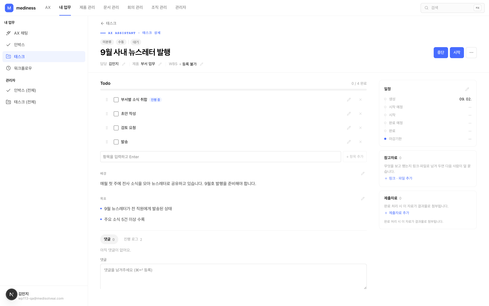
- 방금 만들어진 태스크입니다. 상태 배지가 **대기**이고, 오른쪽 **일정** 카드에는 아직 '생성' 시각만 찍혀 있어요.
- 체크리스트의 첫 항목 옆에 **진행 중** 표시가 붙어 "다음에 할 일"을 알려줍니다.

### 1-2. 진행 중 — [시작]을 누른 뒤
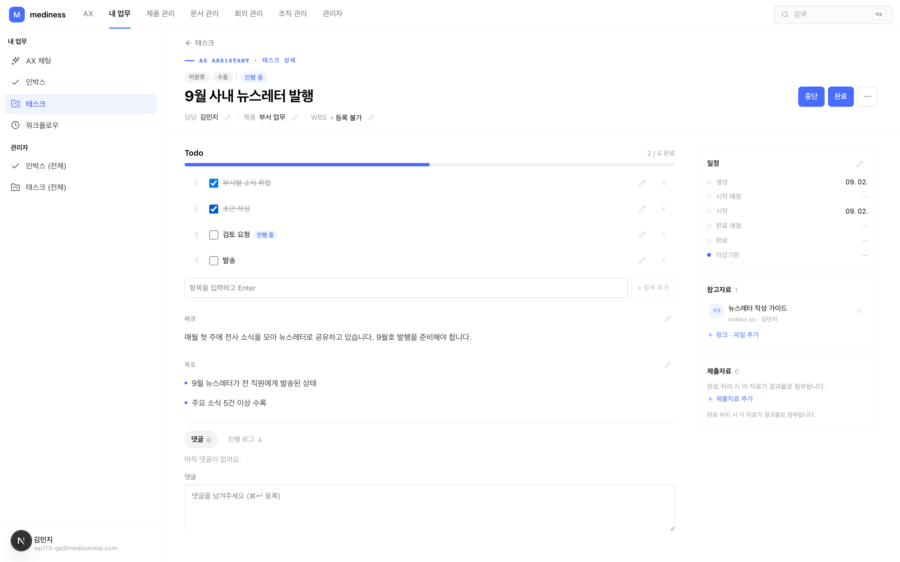
- 오른쪽 위 **[시작]** 버튼을 누르면 진행 중이 됩니다. 일정 카드에 **시작 시각이 자동으로** 찍혀요.
- 일하면서 체크리스트를 하나씩 체크합니다 — 위쪽 진행 바가 같이 차오릅니다.

### 1-3. 중단 — 막혔을 때는 사유와 함께
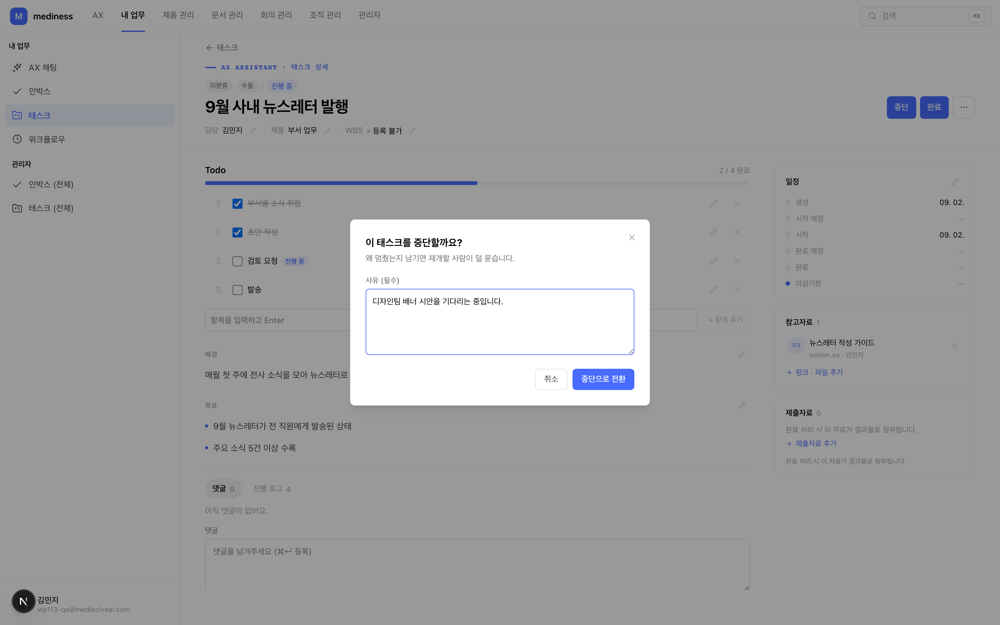
- **[중단]**을 누르면 사유를 묻습니다. "디자인팀 배너 시안을 기다리는 중입니다"처럼 **막힌 이유를 구체적으로** 적어주세요.
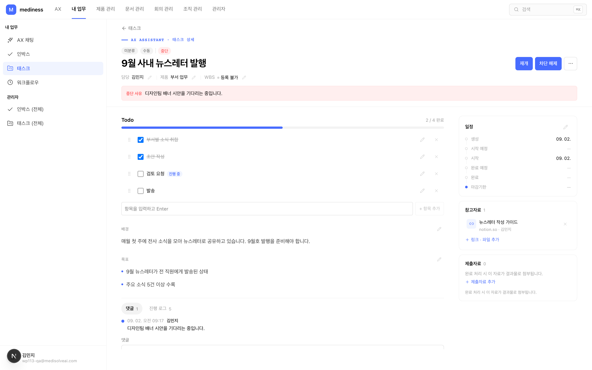
- 중단된 태스크는 사유가 카드에 그대로 보입니다. 막힘이 풀리면 **[재개]**로 다시 진행 중으로 돌아갑니다.

### 1-4. 완료 — 근거를 남기고 마무리
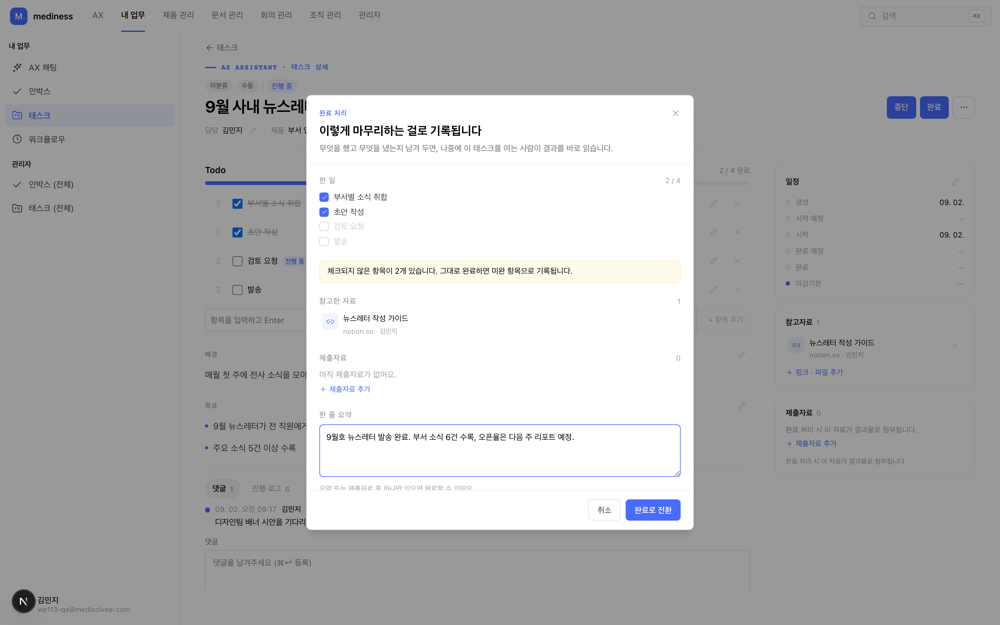
- **[완료]**를 누르면 마무리 창이 뜹니다. 여기서 확인하는 것:
  - **한 일**: 체크리스트 중 안 끝난 항목이 있으면 알려줍니다 (그대로 완료하면 '미완 항목'으로 기록돼요)
  - **제출자료**: 결과물 파일이나 링크를 붙일 수 있습니다
  - **한 줄 요약**: 무엇을 어떻게 마무리했는지 한 줄로 적습니다
- ⚠️ **요약과 제출자료 중 최소 하나는 있어야** 완료됩니다. "완료했는데 뭘 했는지 아무도 모르는" 상황을 막기 위해서예요.

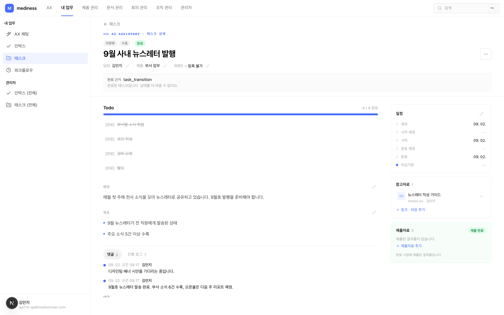
- 완료되면 상태가 **완료**로 바뀌고, 일정에 완료 시각이 찍히고, 제출자료 칸에 **제출 완료** 표시가 붙습니다. 남긴 요약은 댓글·진행 로그에 기록으로 남아요.

---

## 2. 태스크 만드는 방법

### 2-1. 태스크 보드에서 시작합니다
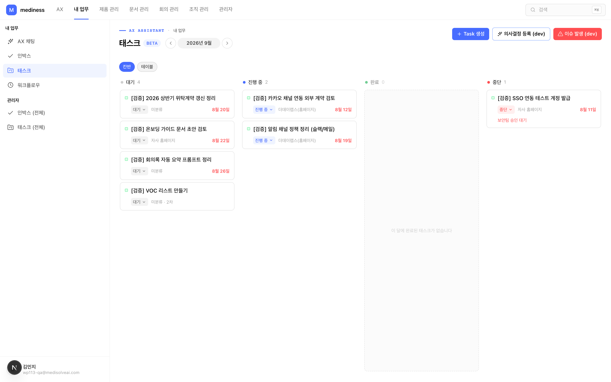
- 상단 메뉴 **내 업무 → 태스크**로 들어오면 내 태스크가 상태별 4개 칸(대기·진행 중·완료·중단)으로 보입니다.
- 오른쪽 위 **[+ Task 생성]** 버튼을 누르세요.

### 2-2. 내용을 채웁니다
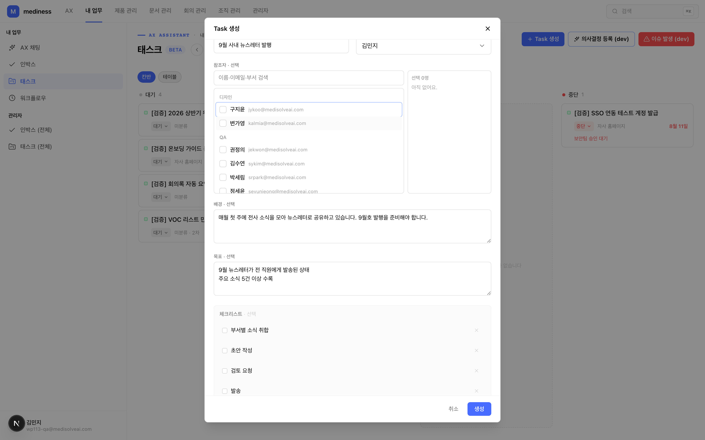

| 칸 | 무엇을 적나 | 팁 |
|---|---|---|
| **제목** (필수) | 할 일을 한 줄로 | "9월 사내 뉴스레터 발행"처럼 결과가 보이게 |
| **담당자** (필수) | 이 일을 할 사람 | **나 말고 다른 사람을 고르면 그 사람에게 "업무 요청"이 됩니다** — 상대의 할 일 목록에 바로 올라가고 슬랙 알림이 가요 |
| 참조자 | 같이 지켜볼 사람 | 진행을 알아야 하는 동료를 추가 |
| **배경** | 왜 이 일을 하나 | 이걸 적어두면 다음 사람이 안 물어봅니다 |
| **목표** | 뭐가 되면 끝인가 | **한 줄에 하나씩** 적으면 목록으로 예쁘게 보여요 |
| **체크리스트** | 단계별 할 일 | 항목 적고 Enter — 진행률의 기준이 됩니다 |
| 참고자료 | 관련 문서·링크·파일 | 미리 붙여두면 태스크가 만들어질 때 함께 올라갑니다 |
| 조직 · 일정 · 제품 | 필요할 때만 | 마감기한을 넣으면 카드에 D-day 가 표시됩니다 |

- **[생성]**을 누르면 끝. 필수는 제목·담당자 둘뿐이니 부담 없이 만들고, 배경·목표는 나중에 채워도 됩니다.

### 2-3. 보드에 카드가 생깁니다
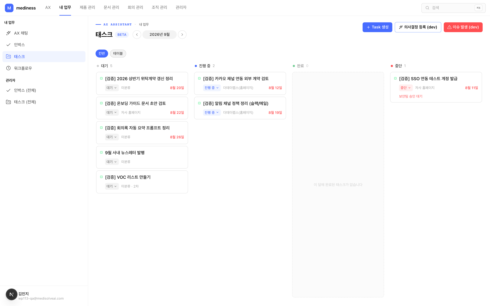
- 새 태스크가 **대기** 칸에 나타납니다. 카드를 클릭하면 상세 화면으로 들어가요.

> 💬 **채팅으로도 만들 수 있어요**: AX 채팅에 "태우님한테 ○○ 업무 요청해줘"라고 말하면 AI가 배경·목표·체크리스트까지 채운 초안 카드를 만들어줍니다. 내용을 확인하고 [등록]을 누르면 그 사람에게 태스크가 갑니다.

---

## 3. 태스크 사용 방법

### 3-1. 상세 화면 읽는 법

- **가운데(본문)**: 체크리스트 → 배경 → 목표 → 댓글·진행 로그 순서
- **오른쪽(요약)**: 일정(생성부터 마감까지 한눈에) · 참고자료 · 제출자료
- **오른쪽 위**: 상태를 바꾸는 버튼([시작]/[완료]/[중단])과 [⋯] 메뉴(수정·재배정·취소·삭제)

### 3-2. 자료는 태스크에 붙여둡니다
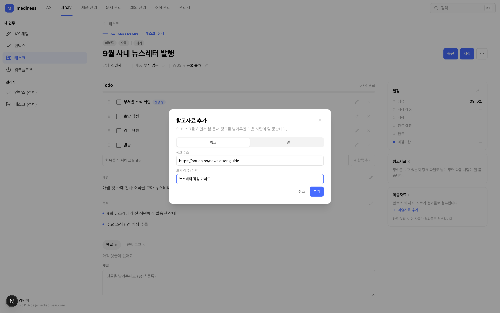
- 참고자료 칸의 **+ 링크·파일 추가**를 누르면 창이 뜹니다. 링크는 주소를, 파일은 선택해서 올려요 (파일당 25MB까지).
- **일하면서 본 문서를 여기 남겨두면, 다음 사람이 덜 묻습니다.** 이미지 파일은 미리보기로, 나머지는 다운로드로 제공돼요.

### 3-3. 소통은 댓글로, 기록은 자동으로
- 궁금한 것·공유할 것은 상세 아래 **댓글**에 남깁니다.
- 상태 변경·수정 같은 이력은 **진행 로그** 탭에 자동으로 쌓여요 — 따로 정리하지 않아도 됩니다.

### 3-4. 보드에서 흐름을 관리합니다
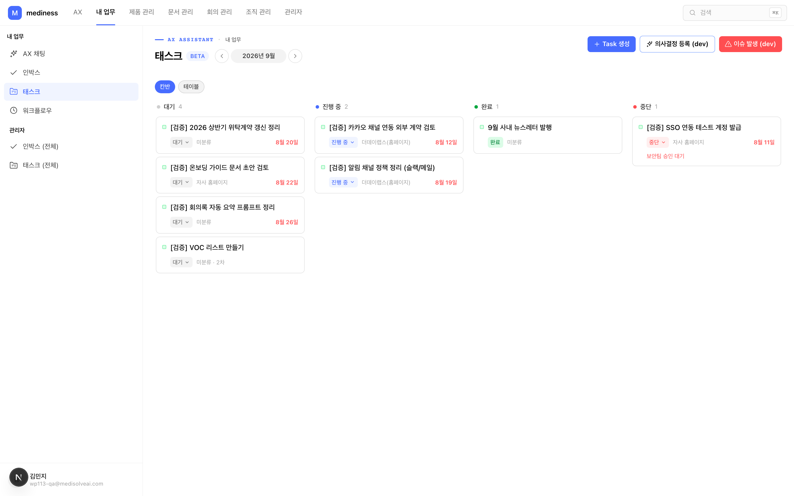
- 카드의 **상태 배지를 클릭하면 그 자리에서 상태를 바꿀 수** 있습니다 (지금 가능한 상태만 보여요).
- **완료 칸은 월 단위로** 보입니다 — 위의 ‹ 9월 › 화살표로 지난달 완료 이력을 돌아볼 수 있어요.
- 마감이 **3일 이내**로 다가오면 카드의 날짜가 강조됩니다.

### 3-5. 남이 나에게 요청한 태스크라면
- 내 할 일에 **요청자 이름이 함께** 표시됩니다 — 누가 시킨 일인지 카드에서 바로 보여요.
- 내가 할 수 없는 일이면 **[⋯] → 재배정 요청**으로 되돌립니다 (거절 버튼은 따로 없어요 — 재배정이 그 역할입니다).
- 요청자는 태스크의 진행 상태를 계속 볼 수 있고, 완료되면 요약과 결과물로 확인합니다.

---

## 부록 — 자주 묻는 질문 (교육 시 Q&A 대비)

- **Q. 시작 안 누르고 일하면요?** — 기록상 계속 '대기'라 팀이 진행 상황을 못 봅니다. 착수하면 꼭 [시작]을 눌러주세요.
- **Q. 완료했는데 결과물이 없는 일이면요?** — 한 줄 요약만 적어도 완료됩니다. 요약조차 없이 완료할 수는 없어요.
- **Q. 잘못 만들었어요.** — [⋯] 메뉴에서 삭제하세요. "하기로 했다가 안 하게 된" 경우는 삭제 대신 **취소**로 남기면 기록이 유지됩니다.
- **Q. 체크리스트를 다 체크하면 자동 완료되나요?** — 아니요. 전부 체크해도 태스크는 진행 중(진행률 100%)으로 남아요. **[완료] 버튼을 눌러 한 줄 요약이나 결과물을 남겨야** 완료됩니다 — "완료됐는데 뭘 했는지 모르는" 태스크를 막기 위해서예요.

## 캡처 파일 목록 (디자인 참고)

| 파일 | 장면 |
|---|---|
| `images/01-board.png` | 태스크 보드(칸반) 전경 |
| `images/02-create-modal.png` | Task 생성 창 — 내용 채운 상태 |
| `images/03-board-todo.png` | 생성 직후 보드(대기 카드) |
| `images/04-detail-todo.png` | 상세 — 대기 상태(구조 설명용) |
| `images/05-reference-modal.png` | 참고자료 추가 창 |
| `images/06-in-progress.png` | 상세 — 진행 중(체크 진행) |
| `images/07-block-modal.png` | 중단 사유 입력 창 |
| `images/08-blocked.png` | 상세 — 중단 상태(사유 배너) |
| `images/09-complete-modal.png` | 완료 등록 창(요약 입력) |
| `images/10-done-detail.png` | 상세 — 완료 상태(제출 완료 배지) |
| `images/11-board-done.png` | 보드 — 완료 칸·월 필터 |
