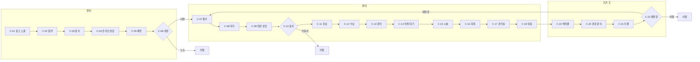

# 01. 고객여정

> 채움 현황 — 총 **132칸** · `[조사]` 0 · `[자료]` 0 · `[인터뷰]` 0 · `[관찰]` 0 · **`[가설→]` 132**
>
> ⚠ **단계 목록 자체가 `[가설]` 이다.** `../병원 AX.md`(TO-BE 서술)와 `../상담실장.md`(직무기술서)
> 두 건에서 역산한 것이고, 실제 병원에서 확인한 바 없다.
>
> 규칙 → [`00-rules.md`](./00-rules.md)

---

## 1.1 여정 전체 `[가설]`

---

## 1.2 단계별 확인표

**여섯 칸 전부 `[가설→]` 이다.** 확인되는 대로 태그를 바꾸고 값을 채운다.

| ID | 단계 | 존재하나 | 공간 | 소요시간 | 담당 | 무엇이 어디에 기록되나 | 이탈 |
|---|---|---|---|---|---|---|---|
| C-01 | 광고 노출 | `[가설→인터뷰]` | `[가설→인터뷰]` | — | `[가설→인터뷰]` | `[가설→인터뷰]` | `[가설→자료]` |
| C-02 | 탐색 | `[가설→인터뷰]` | `[가설→인터뷰]` | — | — | `[가설→인터뷰]` | `[가설→자료]` |
| C-03 | 문의 | `[가설→인터뷰]` | `[가설→인터뷰]` | `[가설→인터뷰]` | `[가설→인터뷰]` | `[가설→인터뷰]` | `[가설→자료]` |
| C-04 | 온라인 상담 | `[가설→인터뷰]` | `[가설→인터뷰]` | `[가설→인터뷰]` | `[가설→인터뷰]` | `[가설→인터뷰]` | `[가설→자료]` |
| C-05 | 예약 · 예약금 | `[가설→인터뷰]` | `[가설→인터뷰]` | — | `[가설→인터뷰]` | `[가설→인터뷰]` | `[가설→자료]` |
| C-06 | 내원 · 노쇼 | `[가설→인터뷰]` | — | — | — | `[가설→인터뷰]` | `[가설→자료]` |
| C-07 | 접수 | `[가설→관찰]` | `[가설→관찰]` | `[가설→관찰]` | `[가설→관찰]` | `[가설→인터뷰]` | — |
| C-08 | 대기 | `[가설→관찰]` | `[가설→관찰]` | `[가설→관찰]` | — | `[가설→인터뷰]` | `[가설→관찰]` |
| C-09 | 대면 상담 | `[가설→관찰]` | `[가설→관찰]` | `[가설→관찰]` | `[가설→관찰]` | `[가설→인터뷰]` | — |
| C-10 | 동의 · 견적 | `[가설→관찰]` | `[가설→관찰]` | `[가설→관찰]` | `[가설→관찰]` | `[가설→인터뷰]` | `[가설→자료]` |
| C-11 | 진료 | `[가설→관찰]` | `[가설→관찰]` | `[가설→관찰]` | `[가설→관찰]` | `[가설→인터뷰]` | — |
| C-12 | 수납 · 결제 | `[가설→관찰]` | `[가설→관찰]` | `[가설→관찰]` | `[가설→관찰]` | `[가설→인터뷰]` | — |
| C-13 | 준비 | `[가설→관찰]` | `[가설→관찰]` | `[가설→관찰]` | `[가설→관찰]` | `[가설→인터뷰]` | — |
| C-14 | 마취 대기 | `[가설→관찰]` | `[가설→관찰]` | `[가설→관찰]` | — | `[가설→인터뷰]` | — |
| C-15 | 시술 | `[가설→관찰]` | `[가설→관찰]` | `[가설→관찰]` | `[가설→관찰]` | `[가설→인터뷰]` | — |
| C-16 | 회복 | `[가설→관찰]` | `[가설→관찰]` | `[가설→관찰]` | `[가설→관찰]` | `[가설→인터뷰]` | — |
| C-17 | 관리실 | `[가설→관찰]` | `[가설→관찰]` | `[가설→관찰]` | `[가설→관찰]` | `[가설→인터뷰]` | — |
| C-18 | 퇴실 · 다음 예약 | `[가설→관찰]` | `[가설→관찰]` | `[가설→관찰]` | `[가설→관찰]` | `[가설→인터뷰]` | — |
| C-19 | 해피콜 | `[가설→인터뷰]` | `[가설→인터뷰]` | `[가설→인터뷰]` | `[가설→인터뷰]` | `[가설→인터뷰]` | — |
| C-20 | 경과 · 부작용 문의 | `[가설→인터뷰]` | `[가설→인터뷰]` | `[가설→인터뷰]` | `[가설→인터뷰]` | `[가설→인터뷰]` | — |
| C-21 | 리콜 | `[가설→인터뷰]` | `[가설→인터뷰]` | `[가설→인터뷰]` | `[가설→인터뷰]` | `[가설→인터뷰]` | — |
| C-22 | 재방문 · 이탈 | `[가설→자료]` | — | — | — | `[가설→인터뷰]` | `[가설→자료]` |

---

## 1.3 먼저 확인할 것 — 단계 목록 자체

**개별 칸을 채우기 전에 목록이 맞는지부터 확인한다.** 목록이 틀리면 칸을 채워도 소용없다.

| # | 확인할 것 | 지금 상태 |
|---|---|---|
| 1 | **C-01 ~ C-22 가 우리 병원에 실제로 다 있나** | `[가설]` |
| 2 | **빠진 단계가 있나** | `[가설]` |
| 3 | **C-09 상담과 C-11 진료의 선후** — 어느 쪽이 먼저인가 | `[가설]` — 근거 없음 |
| 4 | **C-13 준비 · C-14 마취 대기가 실제로 있나** | `[가설]` — 두 문서에 없고 통념으로 넣은 것 |
| 5 | **C-16 회복 · C-17 관리실이 별도 공간인가** | `[가설]` — 방 이름 근거 없음 |
| 6 | **C-12 수납이 상담 직후인가 시술 후인가** | `[가설]` |
| 7 | **시술 종류에 따라 여정이 갈리나** (주사 / 레이저 / 리프팅 / 관리) | `[가설]` — 하나로 그린 것이 맞는지 미확인 |

---

## 1.4 변경 이력

| 일자 | 무엇 | 태그 변화 |
|---|---|---|
| 2026-09-17 | 최초 작성 | 전부 `[가설→]` |
