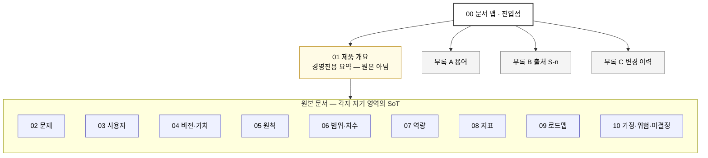

# SC-AX 제품 정의서 — 문서 맵

> **이 파일이 전체 문서의 진입점이다.** 내용은 각 문서에 있고, 여기에는 **지도와 규칙**만 둔다 — 어느 문서가 무엇의 원본인지, 링크를 어떻게 거는지, 고칠 때 무엇을 확인하는지.

## 문서 정보

| 항목 | 값 |
|---|---|
| 문서 버전 | v0.1 — **확인된 범위가 여기까지라는 뜻이며 미완성이라는 뜻이 아니다.** 조사가 늘면 개정한다 (→ 6.7) |
| 상태 | **검증 전 초안** |
| 주 독자 | 의사결정자(대표·경영진), 1차 대상 조직 부서장·담당자 |
| 부 독자 | 이후 개발 주체 · 각 차수 기획 |
| 확정 권한자 | `미확인` — S1 §10-1이 컨펌 주체를 확인 대상으로 남겨 둠 |
| `[결정]` 건수 | **0건** |
| 정보 상태 표기(`[사실]` `[해석]` `[가설]` `[결정]` `미확인`) | 정의는 [부록 A](./A-glossary.md) |

---

## 문서 맵 — 어느 문서가 무엇의 원본인가

**원칙 셋.**

1. **각 문서가 자기 영역의 원본(SoT)이다.** 다른 문서는 요약·참조만 한다.
2. **같은 내용이 두 문서에 생기면** 원본이 아닌 쪽을 요약으로 줄이고 원본을 가리키게 한다.
3. **원본이 애매하면 새로 정하지 말고 묻는다.**

| 영역 | 원본 | 식별자 | 비고 |
|---|---|---|---|
| 근거 자료 | [부록 B](./B-sources.md) | `S-n` | 본문은 인용만 |
| 용어 · 표기 규칙 · 번호 앞글자 | [부록 A](./A-glossary.md) | — | |
| 문제 · 현재 방식 · 공통 원인 | [2절](./02-background-and-problems.md) | `PR-n` | |
| 사용자 · 사용 상황 | [3절](./03-users-and-situations.md) | `US-n` | |
| 비전 · **목표(다섯 축·아홉 상황)** · 가치 제안 · 차별점 | [4절](./04-vision-and-value.md) | — | 1절 1.1·2.1은 사본 |
| 제품 원칙 | [5절](./05-principles.md) | `P-n` | |
| 범위 · **갈래 구조** · **차수 구분** · 보류 · 변경 요구 | [6절](./06-scope.md) | `M-n` `D-n` `OUT-n` `HOLD-n` `CH-n` | 9.1의 차수 표는 이 표의 요약 |
| 역량 · 재현 목록(7.4) | [7절](./07-capabilities.md) | `C-n` | 1차 다섯 모듈만 작성됨 |
| 지표 · 기준선 | [8절](./08-metrics.md) | `F-n` `I-n` `O-n` `H-n` `B-n` | |
| 마일스톤 · 게이트 · 순서 제약 · **기간(「근거가 있는 기간」 표)** | [9절](./09-roadmap.md) | `SP-n` `G-n` | **기간은 그 표 밖에 적지 않는다** |
| 가정 · 위험 · 미결정 | [10절](./10-assumptions-risks-open.md) | `A-n` `R-n` `Q-n` | |
| 변경 이력 | [부록 C](./C-changelog.md) | — | |
| **1절** | **원본 아님 — 전부 요약** | — | 1절을 고치고 싶으면 **원본을 먼저 고친다** |

---

## 목차와 진행 상태

| 문서 | 파일 | 상태 |
|---|---|---|
| 0. 문서 맵 | 이 파일 | 유지 관리 |
| 1. 제품 개요 | [`01-product-summary.md`](./01-product-summary.md) | **초안 완료** — 비전 · 목표 · 제품 · 마일스톤 로드맵 |
| 2. 추진 배경과 핵심 문제 | [`02-background-and-problems.md`](./02-background-and-problems.md) | **초안 완료** — 규모 일부 확보(S13), **횟수 미확보** |
| 3. 대상 사용자와 핵심 사용 상황 | [`03-users-and-situations.md`](./03-users-and-situations.md) | **초안 완료** — **실무자 표본 0건**(설문 회신 4건도 전원 부서장급) |
| 4. 제품 비전과 가치 제안 | [`04-vision-and-value.md`](./04-vision-and-value.md) | **초안 완료** — 실무자 가치 제안 전부 `[가설]` |
| 5. 제품 원칙 | [`05-principles.md`](./05-principles.md) | **초안 완료** — 7건 → 공격 후 5건 |
| 6. 범위와 비범위 | [`06-scope.md`](./06-scope.md) | **초안 완료** — 차수 4개(1~3차 공통 · 4차 부서별 맞춤) |
| 7. 핵심 제품 역량 | [`07-capabilities.md`](./07-capabilities.md) | **초안 완료** — 1차 다섯 모듈만. 2~4차 미작성 |
| 8. 성공 지표 | [`08-metrics.md`](./08-metrics.md) | **초안 완료** — 목표 수치 0건, 효과 판정은 2차 종료 |
| 9. 마일스톤 기반 로드맵 | [`09-roadmap.md`](./09-roadmap.md) | **초안 완료** — 차수 단위, 결정 주체 `미확인` 1건 |
| 10. 가정·위험·미결정 사항 | [`10-assumptions-risks-open.md`](./10-assumptions-risks-open.md) | **초안 완료** — 가정 9 · 위험 12 · 미결정 15 |
| 부록 A. 용어 | [`A-glossary.md`](./A-glossary.md) | **작성 완료** |
| 부록 B. 출처 대장 | [`B-sources.md`](./B-sources.md) | **작성 완료** — S1~S13 |
| 부록 C. 변경 이력 | [`C-changelog.md`](./C-changelog.md) | 진행 |

**식별자 충돌 방지** — 문서마다 다른 접두어를 쓴다. 전체 배정은 [부록 A](./A-glossary.md) 「번호 앞글자」 표가 원본이다.

---

## 링크 규칙 — 하드코딩 금지

1. **문서 사이는 파일 링크만 건다.** `[6절](./06-scope.md)` — 이게 전부다.
2. **앵커(`#소절-제목`) 링크 금지.** 제목 문구가 바뀌는 순간 조용히 깨진다. 수정이 잦은 문서에서 가장 먼저 썩는 부분이다.
3. **소절 위치는 번호 텍스트로 쓴다.** `→ 6.5` 처럼. 절 번호는 제목 문구보다 오래 산다.
4. **같은 문서 안에서는 링크를 걸지 않는다.** 「소절 이름」 텍스트로 가리킨다.
5. **식별자는 그 자체가 주소다.** `PR-3.1` `M-5` `HOLD-2` 는 검색으로 찾는다 — 링크를 걸지 않는다.

---

## 수정 방법

1. **원본을 찾는다.** 위 문서 맵에서 고칠 내용의 원본 파일을 확인하고, **원본을 고친다.** 요약(1절)이나 참조를 먼저 고치지 않는다.
2. **원본 자리의 「✎ 같이 확인」 메모를 따른다.** 거기 적힌 곳을 전부 확인한 뒤 작업을 닫는다.
3. **복사본을 줄인다.** 다른 문서에 같은 내용이 있으면 요약으로 강등하고 원본을 가리키게 한다.
4. **변경 이력에 한 줄 남긴다.** → [부록 C](./C-changelog.md)
5. **앵커 링크를 새로 만들지 않았는지 확인한다.**

### 전파는 원본 자리에 적혀 있다 — 중앙 지도를 두지 않는다

**고칠 곳에 도착하면 그 자리에 메모가 있다.** 각 원본(SoT) 소절 머리에 아래 형태의 한 줄이 붙어 있다.

> ✎ **여기를 고치면 같이 확인** — …

- **중앙 전파 지도를 두지 않는 이유** — 소절 번호·표 이름을 모아 둔 중앙 표는 앵커 링크와 같은 병에 걸린다. 절을 재구성할 때마다 낡고, 편집 현장에서 보이지 않아 안 고쳐진다. 실제로 9절을 재구성할 때마다 지도가 세 번 낡았다.
- **메모는 내용과 함께 움직인다.** 소절을 고치는 사람이 그 자리에서 메모를 보고, 소절이 바뀌면 메모도 같이 고친다.
- **전부 찾으려면** `같이 확인` 으로 검색한다.
- **새 의존이 생기면** 원본 자리의 메모에 한 줄 더한다 — 여기(00)가 아니다.

---

## 절별로 정한 것

작성 전에 합의한 구조 결정이다. 절 안에서 다시 설명하지 않는다.

| # | 결정 | 내용 | 이유 |
|---|---|---|---|
| 1 | PR 구조 | **2계층** — 대분류는 S1의 문제 분류를 계승하고, 하위에 원자료의 구체 사례를 번호로 단다 (`PR-1.1`) | 사례가 20건 가까이 나와 평면으로 늘어놓으면 우선순위가 사라진다 |
| 2 | 공통 원인 | **3개** — ① 담당자·진행 상황의 단절 ② 데이터·도구의 분산과 소유권 부재 ③ 목표 인식의 불일치 | S1 §2의 보안 축은 ②에서만 설명되고, 목표 진술 차이(S9)는 ①②로 덮이지 않는다 |
| 3 | 보안 취급 | **PR로 올린다.** 단 **특정 도구·제작자를 지목하지 않는다** | 실제 노출이 확인된 사안이나, 사람·팀을 지목하면 책임 추궁으로 읽혀 협조가 끊긴다 |
| 4 | 요구서 취급 | 요구서(S4~S7)는 **2절에 직접 넣지 않는다.** 요구 뒤의 문제만 역산해 PR로, 요구 자체는 7절 역량 후보로 | 요구서는 문제가 아니라 해결책 요청이다 |
| 5 | 개인정보 | **실명을 쓰지 않는다 — 역할명만.** 급여 단가·정산 금액은 "현행 확정 규칙이 존재한다"로만 참조 | 원자료에 실명·급여·계좌 항목이 포함되어 있다 |

---

## 작성 기록

스킬 사용 기록과 템플릿 회수 대장은 [`_working/skills-log.md`](./_working/skills-log.md)에 있다. **작업 기록이지 제품 문서가 아니다.**
