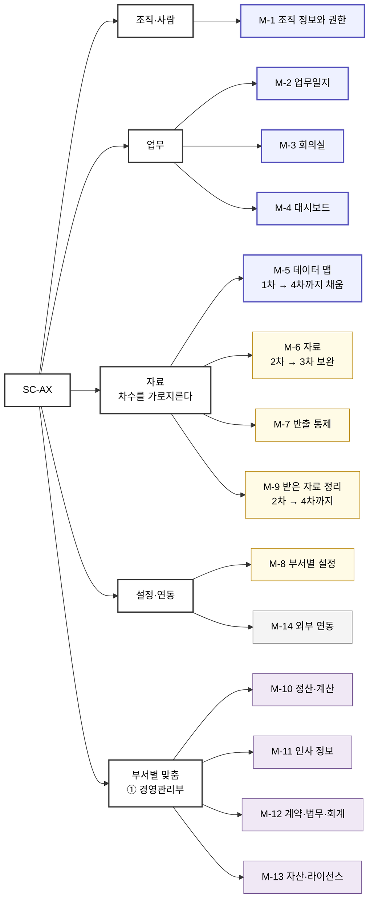

# 1. 제품 개요

> SC-AX 제품 정의서 v0.1 · 검증 전 초안
> 허브: [`00-overview.md`](./00-overview.md)

---

## 1.1 비전

> 원본: [4절](./04-vision-and-value.md) 4.1

> ## 일한 것이 그대로 기록이 되고, 그 기록이 회사의 현황이 된다.
>
> **따로 적지 않아도 남고, 묻지 않아도 보인다.**

---

## 1.2 문제 상황

**지금은 두 번 일한다.** 일하고 나서 기록을 위해 또 적고, 진행을 알려면 물어봐야 한다.

| 무엇이                     | 어떻게                                                                           |
| ----------------------- | ----------------------------------------------------------------------------- |
| **부서를 넘으면 끊긴다**         | 담당자를 몰라 자리로 찾아간다. 다른 부서의 진행 상황은 물어봐야 안다. 회의에서 나온 일은 담당자가 안 정해진 채 끝난다          |
| **자료가 흩어져 있고 주인이 없다**   | 개인 계정·개인 PC·공유 컴퓨터에 나뉘어 있다. **어디에 무엇이 있는지 아무도 모르고**, 누가 봤는지도 무엇이 나갔는지도 알 수 없다 |
| **무엇을 위해 하는지가 팀마다 다르다** | 어떤 팀은 이미 도구를 직접 만들어 쓰고, 어떤 팀은 개념부터 필요하며, 어떤 팀은 지금 방식으로 충분하다고 본다               |

`[사실]` 확인된 문제는 **43건**이다. 위 셋은 그 43건의 공통 원인이다. → [2절](./02-background-and-problems.md)

**지금 쓰는 아홉 가지 방식 중 어느 것으로도 안 되는 것이 둘이다.**

| 안 되는 것                         | 왜                                                                        |
| ------------------------------ | ------------------------------------------------------------------------ |
| **다른 부서의 자료·담당자·진행 상황을 찾는 것**  | 부서나 개인이 도입한 도구는 **그 범위 안에서 완결되도록** 만들어져 있다. 완성도의 문제가 아니다                 |
| **누가 열어봤고 무엇이 밖으로 나갔는지 남기는 것** | **기록은 자료를 가진 쪽만 남길 수 있다.** 자료가 개인 계정·개인 PC에 있는 동안에는 회사가 기록을 남길 위치 자체가 없다 |

`[해석]` **이 둘이 새로 만드는 유일한 이유다.** 나머지는 지금 방식으로도 어느 정도 된다.

---

# 2. 목표

## 2.1 목표 설정

> 원본: [4절](./04-vision-and-value.md) 4.1 「목표 — 다섯 축」. **여기는 요약이다 — 고칠 때는 원본을 먼저 고친다.**

**구체적인 방향은 다음과 같다.**

| 목표                   | TO-BE                                                         | AS-IS                                                    | NEED                         |
| -------------------- | ------------------------------------------------------------- | -------------------------------------------------------- | ---------------------------- |
| **업무** — 비효율 제거      | 회의록·업무일지를 손으로 쓰지 않고, **할 일 배정이 회의에서 끝난다**                     | 이미 한 일을 업무일지에 다시 쓴다. 회의가 끝나도 담당자가 안 정해진 채 넘어간다           | 회의·업무 데이터를 한 곳에 모은다          |
| **소통** — 담당자·진행 조회   | 자리로 찾아가지 않고 **담당자와 근무 상태를 화면에서 확인한다**                         | 담당자를 몰라 자리로 찾아간다. 없으면 기다린다                               | 조직도·근태를 전 부서가 같은 화면에서 본다     |
| **보안** — 데이터 통제      | 사내 데이터가 개인 계정으로 나가지 않고, **팀·직급별로 볼 수 있는 범위가 나뉘며, 나간 기록이 남는다** | 개인 계정·개인 PC·공유 컴퓨터에 흩어져 있고, **누가 봤는지도 무엇이 나갔는지도 알 수 없다** | 권한 체계 · 접근 기록 · 반출 기록        |
| **관리** — 현황 파악       | 대표·관리자가 **따로 요청하지 않아도 진행 상황을 확인한다**                           | 물어봐야 안다. 인력·업무 파악을 수기로 한다                                | **위 세 가지가 한 시스템에 쌓인다**       |
| **데이터** — 무엇이 어디 있는지 | **어느 부서가 어떤 자료를 어디에 갖고 있는지 회사가 안다**                           | 어디에 무엇이 있는지 아무도 모른다. 폴더를 뒤지고 사람에게 묻는다                    | 전 부서 데이터 조사와 **그 결과를 담을 자리** |

`[사실]` 앞의 네 축은 **S1 §2에서 이미 합의된 목표 구분**이다.

`[해석]` **다섯째는 이 문서가 더했다.** 조사가 계약 범위에 들어오면서 생겼다. **자기 데이터가 어디 있는지 모르면 보안도 관리도 성립하지 않으므로**, 앞 네 축의 밑에 깔리는 목표다.

`[해석]` **「관리」만 성격이 다르다 — 나머지의 결과다.** 현황 확인을 앞세우면 감시로 받아들여져 기록이 남지 않고, **기록이 없으면 확인할 현황도 없다.** → [P-2](./05-principles.md)

**수치 목표는 두지 않는다.** 지금이 어느 정도인지 잰 적이 없어 *"몇 퍼센트 개선"* 이라고 쓰면 근거 없는 약속이 된다. **TO-BE가 실제로 그렇게 되었는지**가 판정 기준이며, 무엇으로 관찰할지는 [8절](./08-metrics.md)에서 정한다.

---

# 3. 제품

## 3.1 제품 방향성

**목표를 이루는 방법에는 여러 갈래가 있다. 무엇을 택하고 무엇을 버렸는지 적는다.**

| # | 택한 방향 | 택하지 않은 것 |
|---|---|---|
| **1** | **쓰던 도구를 바꾸지 않는다.** 부서를 넘는 일만 한 곳으로 모으고, 부서 안의 규칙은 부서가 정한다 | 도구를 하나로 통일하고 전부 옮기게 한다 |
| **2** | **이미 어딘가에 있는 정보를 다시 넣게 하지 않는다.** 한 일이 그대로 기록이 되게 만든다 | 정확한 기록을 위해 입력 항목을 늘린다 |
| **3** | **현황판을 앞세우지 않는다.** 관리 가시성은 기록이 쌓인 **결과**로 둔다 | 관리 화면부터 만들어 현황을 먼저 확보한다 |
| **4** | **되돌릴 수 없는 것만 사람이 멈춰 세운다.** 할 일이 뽑히고 일지가 만들어지는 것은 흐르게 두고, **권한 변경과 남에게 일을 넘기는 것**만 확인한다 | 중요한 것마다 승인 단계를 둔다 |
| **5** | **전 부서 공통을 먼저 만들고, 부서별 맞춤은 뒤에 붙인다** | 요구가 들어온 부서부터 하나씩 완성한다 |

`[해석]` **1과 3이 성패를 가른다.** 도구를 통일하면 저항이 생겨 아무도 안 쓰고, 현황판을 앞세우면 감시로 읽혀 기록이 안 남는다. **둘 다 「만들었는데 안 쓰는」 결과로 간다.**

`[해석]` **5가 차수 구성을 결정한다.** 1~3차가 전 부서 공통이고, **4차부터가 부서별 맞춤**이다.

다섯 방향의 근거와 그것이 갈랐던 실제 결정은 [5절](./05-principles.md)에 있다.

---

## 3.2 기능 구성

> 원본: [6절](./06-scope.md) 6.1 「갈래 구조」. **여기는 요약이다.**

**다섯 갈래, 모듈 열넷이다.** 1차에 만드는 다섯은 굵게 표시했다.

| 갈래 | 모듈 | 무엇을 하나 | 차수 |
|---|---|---|---|
| **조직·사람** | **M-1 조직 정보와 권한** | 조직도·직급·담당 업무·근무 상태 조회 · **누가 무엇을 볼 수 있는지** · 본 기록 · 공지·알림 | **1차** |
| **업무** | **M-2 업무일지** | 업무 등록·배정·진행 상태 · **기록에서 일지·보고서 파생** · 팀 캘린더 · 마감 알림 | **1차** |
| | **M-3 회의실** | 녹음·회의록 · **결정과 할 일 추출** · 담당자 배정 · 열람 범위 | **1차** |
| | **M-4 대시보드** | 개인·팀·전사 현황 · 통계와 리포트 | **1차** |
| **자료** *(차수를 가로질러 이어진다)* | **M-5 데이터 맵** | 어떤 자료가 **어느 부서에 어떤 형태로 어디에** 있는지 · 실제 자료로 링크 · 부서 간 이동 경로 · 민감 정보 표시 | **1차** → **4차까지 계속 채운다** |
| | M-6 자료 | 문서 저장·검색 · 서식함·자료실 · 버전과 수정 이력 · 통합 검색 | 2차 → **3차 보완** |
| | M-7 반출 통제 | 나가기 전 확인 · **나간 기록** · 다운로드 이력 | 2차 → **부서가 늘 때마다 대상 확대** |
| | M-9 받은 자료 정리 | 밖에서 받은 자료를 정해진 형태로 · 매출·순위·뉴스 수집 | 2차 → **부서별로 형태가 다르므로 4차까지 이어진다** |
| **설정·연동** | M-8 부서별 설정 | 팀마다 다른 화면·양식·흐름 · TF 단위 공간 | 2차 |
| | M-14 외부 연동 | 전자결재·전자서명 · 채용 사이트 · 메신저 · 문자 발송 | 3차 |
| **부서별 맞춤** ① 경영관리부 | M-10 정산·계산 | 근태·야근수당 · 식대 | **4차** |
| | M-11 인사 정보 | 직원 명부·문서 · 비자·계약 만료 알림 · 업무분장·인수인계 | **4차** |
| | M-12 계약·법무·회계 | 계약서 작성과 관리대장 · 회계 자료 | **4차** |
| | M-13 자산·라이선스 | 소프트웨어 계정·라이선스 · 비품 | **4차** |

`[사실]` 1~3차 구분의 주 근거는 **고객사 개발요청서 §30**이다. → [6.1](./06-scope.md)

`[해석]` **4차는 요구서에 없다 — 이 문서가 세운 것이다.** **1~3차가 전 부서 공통이고 4차부터가 부서별 맞춤**이며, 첫 번째가 경영관리부인 이유는 **지금까지 들어온 요구가 그 부서 것이기 때문**이다. 다른 부서의 요구가 들어오면 그 부서가 5차·6차가 된다.

`[해석]` **「자료」 갈래만 한 차수에 끝나지 않는다.** 부서가 하나 붙을 때마다 **다룰 자료가 늘고, 지도에 채울 것이 늘고, 반출을 통제할 대상이 는다.** 그래서 2차에 만들고 **3차에 보완하며 4차까지 이어진다.** 나머지 갈래는 만들면 끝나지만 자료는 **계속 관리하는 대상**이다.

`[해석]` **1차 다섯은 나머지의 바탕이다.** 조직 정보가 없으면 배정할 대상도 권한을 걸 단위도 없고, 업무 기록이 없으면 현황도 없다.

---

## 3.3 기능 말고 알아내야 하는 것

**만드는 일과 나란히, 전 부서가 어떤 자료를 어디에 갖고 있는지 조사한다.**

| 무엇 | 산출물 |
|---|---|
| 부서별 데이터 목록 | 어떤 자료를 어디에 어떤 형태로 보관하는지 · 부서 간 이동 경로 · **민감 정보 소재** |
| 팀별 요구사항 | 팀별 불편과 필요한 기능. **공통과 팀 특화를 구분** |

`[해석]` **조사는 자료를 옮기는 일이 아니다.** 존재와 위치만 확인하고 **내용물은 받지 않는다.** 그 결과가 담기는 자리가 **M-5**다.

`[해석]` **팀별 요구사항 조사가 4차 이후를 결정한다.** 어느 부서를 다음에 할지는 이 조사 결과로 정한다.

---

## 3.4 하지 않는 것

| 무엇 | 왜 |
|---|---|
| 개인마다 다르게 맞춘 AI | 조직·팀 단위까지만 하기로 합의했다 |
| 전자결재 자체 구현 | 법적 요건을 새로 갖추는 것은 대체가 아니라 중복이다. **기존 그룹웨어와 연결한다** |
| 고객사 진료 시스템 대체 | 고객사 자산이며 통제 밖이다 |
| **이미 쌓인 자료를 옮겨 넣는 것** | 규모가 크고 대부분 다시 열지 않는다. **어디 있는지는 알아내되 옮기는 것은 전제하지 않는다** |
| PC 단에서 자료 반출을 막는 것 | 별도 영역의 제품이 필요하다. **시스템 안에서 나가는 것만** 다룬다 |

---

# 4. 마일스톤 로드맵

## 4.1 차수 구성

**차수는 넷이다.** 1~3차가 전 부서 공통이고, **4차부터가 부서별 맞춤**이다.

> **1차는 「효과」가 아니라 「골격과 기준선」을 만드는 차수다.**
> 1차는 짧아 **쓰는 기간이 없다.** 일하는 방식이 실제로 바뀌었는지는 **2차가 끝나는 시점에 판정한다.**

**차수 안의 주차별 일정·인원 배치는 이 문서가 정하지 않는다.** 각 차수를 맡는 기획이 이 문서를 받아 만든다.

---

## 4.2 마일스톤

**「무엇을 만들었나」가 아니라 「무엇이 가능해졌나」로 판정한다.**

| # | 마일스톤 | 무엇이 가능해지는가 | 시점 |
|---|---|---|---|
| **SP-0** | 착수 | 시작할 수 있는 상태가 된다 — 조직 정보 · 담당자 지명 · 설문 발송 | 1차 시작 |
| **SP-1** | 조직 골격 | **다른 부서 사람을 찾고, 누가 무엇을 열어봤는지 남는다** | 1차 |
| **SP-2** | 업무 기록 | **한 일이 기록이 되고, 준 일이 어디까지 갔는지 보인다** | 1차 |
| **SP-3** | 회의 연결 | **회의에서 나온 일이 그 자리에서 담당자에게 넘어간다** | 1차 |
| **SP-4** | 현황 | **묻지 않고 본다** (개인·팀 화면) | 1차 |
| **SP-5** | 데이터 지도 | **어느 부서가 무엇을 어디에 갖고 있는지 회사가 안다** | 1차 |
| **SP-6** | **1차 완료** | **다음에 무엇을 만들지 정할 수 있다** | 1차 종료 |
| **SP-7** | 자료와 통제 | 자료를 찾고, **밖으로 나간 것이 남고**, 팀마다 다르게 쓴다 | 2차 |
| **SP-8** | **2차 완료** | **일하는 방식이 실제로 바뀌었는지 답할 수 있다** | 2차 종료 |
| **SP-9** | 바깥 연결 | 회사 밖 절차(전자결재·전자서명·채용·문자)까지 이어진다 | 3차 |
| **SP-10** | 부서별 맞춤 ① | **경영관리부의 일이 시스템 안으로 들어온다** | 4차 |

`[해석]` **SP-6과 SP-8은 만드는 일이 아니라 판정하는 일이다.** 마일스톤으로 세우지 않으면 **판정할 시간이 일정에 없어서** 다음 차수가 그냥 시작된다.

### 바꿀 수 없는 순서

**조직 정보 → 업무일지 → 회의실 → 현황판.** 데이터 지도는 조사 결과가 나오는 대로 채운다.

`[해석]` **업무일지가 회의실보다 먼저인 이유** — 회의에서 할 일을 뽑아도 **업무일지가 없으면 갈 곳이 없어 회의록만 쌓인다.**

`[해석]` **현황판이 마지막인 이유** — 기록이 쌓이기 전에 앞세우면 **감시로 읽혀 기록이 남지 않는다.**

### 만드는 차수와 켜는 차수가 다른 것

| 무엇 | 1차 | 2차 | 왜 |
|---|---|---|---|
| **업무일지 자동 생성** | 만들고 **끈다** | 켠다 | 켜기 전 직접 입력 비율이 **비교 기준**인데, 켠 뒤에는 비교 대상이 사라진다 |
| **전사 현황 화면** | 만들고 **끈다** | 켠다 | **쌓인 기록이 적은 채로 켜면** 보여줄 것이 없고 **감시로만 읽힌다** |
