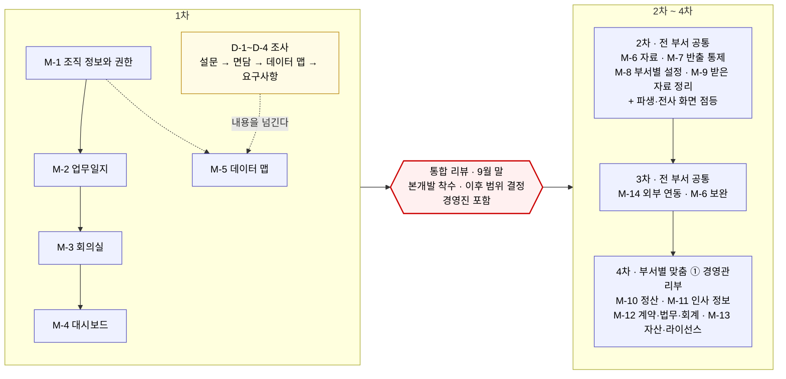
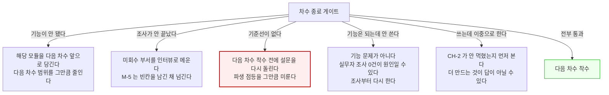

# 9. 마일스톤 기반 로드맵

> SC-AX 제품 정의서 v0.1 · 검증 전 초안
> 허브: [`00-overview.md`](./00-overview.md) · 앞 절: [`08-metrics.md`](./08-metrics.md) · 다음 절: [`10-assumptions-risks-open.md`](./10-assumptions-risks-open.md)

---

## 이 절이 정하는 것과 정하지 않는 것

**이 문서는 프로젝트 전체의 제품 정의서다.** 이 절은 **차수 단위**로 정한다 — 무엇을 몇 차에 만들고, 차수 사이에 어떤 결정이 있으며, 각 차수가 끝나면 무엇이 되는가.

| | |
|---|---|
| **여기서 정한다** | 전체 기간과 차수 구성 · 차수별 범위 · **차수 사이의 게이트** · 모듈 사이의 순서 제약 · 각 차수의 통과 조건 |
| **여기서 정하지 않는다** | **차수 안의 주차별 일정 · 인원 배치 · 작업 분해** |

`[해석]` **차수 안의 상세 계획은 그 차수를 맡는 기획이 이 문서를 받아서 만든다.** 여기서 주차까지 쪼개면 인원도 모르는 채 만든 일정이 되고, 기획이 그것을 근거로 착각한다. **이 절은 그 기획의 입력이지 대체물이 아니다.**

**1차분 기획이 받아 갈 것** — [6.3 1차 범위](./06-scope.md) · [7절 역량 C-1~C-24](./07-capabilities.md) · [7.4 재현 목록 14건](./07-capabilities.md) · [8절 기준선 창](./08-metrics.md) · 이 절의 **순서 제약과 통과 조건**.

---

## 9.1 전체 로드맵

> **차수 구분(무엇이 몇 차인가)의 원본은 [6절](./06-scope.md) 6.1이다.** 아래는 순서를 보이기 위한 요약이다.

| 차수 | 무엇을 |
|---|---|
| **1차** | **M-1 ~ M-5** + 조사 D-1 ~ D-4 |
| **2차** | M-6 자료 · M-7 반출 통제 · M-8 부서별 설정 · M-9 받은 자료 정리 |
| **3차** | M-14 외부 연동 · **M-6 보완** |
| **4차** | **부서별 맞춤 ① 경영관리부** — M-10 · M-11 · M-12 · M-13 |

### 근거가 있는 기간 — 기간은 이 표에만 적는다

| 무엇 | 기간 | 근거 |
|---|---|---|
| 1차 | **1개월** | 사용자 확정 |
| 전체 (4차까지) | **약 4개월** | `[사실]` S1 · S8 |
| 설문 응답 | 배포 후 **1주** | `[사실]` S1 §7-3 |
| 팀별 면담 | 담당자 배정 후 **2주** | `[사실]` S1 §7-5 |
| 시연 | **3회** (회당 30~60분) | `[사실]` S1 §7-6 |
| **통합 리뷰** | **9월 말**, 경영진 포함 | `[사실]` S1 §7-7 |
| 부서 실부담 | 설문 15~30분 · 면담 60~90분 + 관찰 반나절 | `[사실]` S1 §7 |

**본문 어디에도 기간을 다시 적지 않는다.** 차수와 조건으로만 말한다 — 기간이 바뀌면 이 표 한 곳만 고친다.

`[해석]` **1~3차가 전 부서 공통이고, 4차부터가 부서별 맞춤이다.** 첫 번째가 경영관리부인 이유는 **지금까지 들어온 요구가 그 부서 것이기 때문**이며, 다른 부서의 요구가 들어오면 그 부서가 5차·6차가 된다.

`[해석]` **「자료」는 한 차수에 끝나지 않는다.** 부서가 붙을 때마다 다룰 자료가 늘고, 지도에 채울 것이 늘고, 반출을 통제할 대상이 는다. **만들면 끝나는 것이 아니라 계속 관리하는 대상이다.**

### 마일스톤

> ✎ **여기를 고치면 같이 확인** — 마일스톤·순서를 바꾸면 → 9.2 순서 제약 · 9.3 게이트 · 8절 기준선 확보 시점 · **1절 4.2 (사본)**

**시점은 차수까지만 적는다.** 차수 안의 주차 배치는 그 차수 기획이 정한다.

| # | 마일스톤 | 무엇이 가능해지는가 | 시점 | 무엇을 만드나 | 통과 조건 | 상태 |
|---|---|---|---|---|---|---|
| **SP-0** | **착수** | 시작할 수 있는 상태가 된다 | 1차 시작 | — | 조직 정보 수령(`CH-1`) · 담당자 3명 지명 · **대표 명의 목적 공지** · 설문 발송 → **G-1** | 예정 |
| **SP-1** | **조직 골격** | **다른 부서 사람을 찾고, 지금 말할 수 있는지 안다. 누가 무엇을 열어봤는지 남는다** | 1차 | M-1 (C-1~C-5 · C-19 · C-20) | 조회·권한·접근 기록이 동작한다 · **[7.4](./07-capabilities.md) 조직 관련 3건 재현** | 예정 |
| **SP-2** | **업무 기록** | **한 일이 기록이 되고, 준 일이 어디까지 갔는지 보인다** | 1차 | M-2 (C-7~C-9 · C-11 · **C-10은 만들되 끈다**) | **[7.4](./07-capabilities.md) 업무 관련 8건 재현** — 특히 이월이 원본과 한 흐름으로 묶인다 | 예정 |
| **SP-3** | **회의 연결** | **회의에서 나온 일이 그 자리에서 담당자에게 넘어간다** | 1차 | M-3 (C-12~C-15) | 배정이 사람 승인을 거쳐 넘어간다 ([P-5](./05-principles.md)) | 예정 |
| **SP-4** | **현황** | **묻지 않고 본다** | 1차 | M-4 (C-16·C-17 · **C-18은 만들되 끈다**) | **[7.4](./07-capabilities.md) 화면 관련 3건 재현** — 특히 통계 숫자를 누르면 목록이 열린다 | 예정 |
| **SP-5** | **데이터 지도** | **어느 부서가 무엇을 어디에 갖고 있는지 회사가 안다** | 1차 | M-5 (C-21~C-24) + **조사 D-1~D-4** | 눌러서 **실제 자료로 간다**. 목록만 있으면 미달 · **미회수 부서 0** | 예정 |
| **SP-6** | **1차 완료** | **2차에 무엇을 만들지 정할 수 있다** | 1차 종료 | 통합 리뷰 자료 | 아래 「차수별 통과 조건」 1차 → **G-4** | 예정 |
| **SP-7** | **자료와 통제** | **자료를 찾고, 밖으로 나간 것이 남고, 팀마다 다르게 쓴다** | 2차 | M-6 · M-7 · M-8 · M-9 | 차별점 **②-b가 동작한다** | 예정 |
| **SP-8** | **2차 완료** | **일하는 방식이 실제로 바뀌었는지 답할 수 있다** | 2차 종료 | **사후 조사** | **[4.1의 아홉 줄](./04-vision-and-value.md)을 [8절 지표](./08-metrics.md)로 판정** → **G-7** | 예정 |
| **SP-9** | **바깥 연결** | **회사 밖 절차(전자결재·전자서명·채용·문자)까지 이어진다** | 3차 | M-14 · **M-6 보완** | 외부 연동이 실제 업무 흐름에서 끊기지 않는다 · 통합 검색이 동작한다 | 예정 |
| **SP-10** | **부서별 맞춤 ①** | **경영관리부의 일이 시스템 안으로 들어온다** | 4차 | M-10 · M-11 · M-12 · M-13 | 정산·인사·계약·자산이 손으로 하던 것에서 넘어온다 · `HOLD-2` 법무 검토 완료 | 예정 |

`[해석]` **SP-6과 SP-8은 만드는 일이 아니라 판정하는 일이다.** 이것을 마일스톤으로 세우지 않으면 **판정할 시간이 일정에 없어서** 다음 차수가 그냥 시작된다.

`[해석]` **SP-5에 조사(D-1~D-4)를 묶었다.** 조사는 기능을 기다리지 않고 따로 돌지만(9.2 제약 6), **결과가 담기는 자리가 M-5**이므로 완료 판정은 같이 한다.

### 차수별 통과 조건

| 차수 | 통과 조건 |
|---|---|
| **1차** | ① 차별점 ①·②-a가 **동작한다** ② [7.4 재현 14건](./07-capabilities.md) ③ **조사 D-1~D-4 완료** ④ **[기준선](./08-metrics.md) 확보** ⑤ 2차 범위를 정할 수 있다 |
| **2차** | 차별점 **②-b가 동작한다**(M-7) · **[4.1의 아홉 줄](./04-vision-and-value.md)이 실제로 일어났는지 사후 조사로 판정** |
| **3차** | 외부 연동이 업무 흐름에서 끊기지 않는다 · 통합 검색이 동작한다 |
| **4차** | 경영관리부가 손으로 하던 일이 시스템 안으로 넘어온다 · **다음 부서를 정할 수 있다** |

`[사실]` **1~3차** 구분의 주 근거는 고객사 개발요청서 §30이다 → [6.1](./06-scope.md). **4차는 이 문서가 세웠다.**

`[해석]` **차수별 기간 배분은 여기서 정하지 않는다.** 중요한 것은 **순서와 게이트**이고, 기간 배분은 인원이 정해진 뒤 각 차수 기획이 산정한다. **차수가 넷이 되었다는 이유로 배분을 미리 못 박으면 다시 지어내는 일이 된다.**

`미확인` **투입 인원.** 1차 한 차수에 다섯 모듈이다. **이것이 전체 계획의 최대 변수다.**

---

## 9.2 순서 제약 — 차수 안에서 지켜야 하는 것

**주차는 기획이 정하지만, 아래 순서는 바꿀 수 없다.** 바꾸면 만들어도 쓸 수 없는 상태가 된다.

| # | 제약 | 왜 |
|---|---|---|
| **1** | **M-1이 가장 먼저** | 누가 누구인지 모르면 배정할 대상도, 권한을 걸 단위도, 화면을 나눌 기준도 없다 → [7.2](./07-capabilities.md) |
| **2** | **M-2가 M-3보다 먼저** | C-14는 [7.3](./07-capabilities.md)대로 *C-7과 같은 자리로 들어간다.* **업무일지가 없으면 회의에서 뽑은 할 일이 갈 곳이 없어 회의록만 쌓인다** |
| **3** | **M-4는 기록이 쌓인 뒤** | 기록 전에 현황판을 앞세우면 감시로 읽혀 기록이 남지 않는다 → [P-2](./05-principles.md) |
| **4** | **M-5는 그릇과 내용을 나눈다** | 그릇은 M-1만 있으면 되고, 내용은 D-2·D-3이 나와야 채워진다. **두 트랙이 만나는 유일한 지점** |
| **5** | **C-19(수정 이력)는 M-1과 같이** | 나중에 붙이면 **그 전 기록이 비어 있다.** 되돌릴 수 없다 |
| **6** | **조사는 기능을 기다리지 않는다** | 트랙 A와 B는 독립이다. 조사가 늦어도 M-1~M-4는 멈추지 않는다 → [6.3](./06-scope.md) |

---

## 9.3 차수 경계에서 켜는 것 — 1차에 만들되 2차에 켠다

`[해석]` **1차는 짧아 쓰는 기간이 없다.** 그래서 두 기능은 **만들되 1차에 켜지 않는다.** 이건 일정 문제가 아니라 [8절](./08-metrics.md)과 [5절 원칙](./05-principles.md)이 요구하는 것이다.

| 무엇 | 1차 | 2차 | 왜 |
|---|---|---|---|
| **C-10 업무일지 파생** | 만들고 **끈다** | 켠다 | 켜기 전 직접 입력 비율이 [I-2·O-2](./08-metrics.md)의 기준선인데, **켠 뒤에는 비교 대상이 사라진다.** 1차 내내 꺼 두면 그 기간이 그대로 사전값이 된다 |
| **C-18 전사 현황 화면** | 만들고 **끈다** | 켠다 | 쌓인 기록이 적은 채로 켜면 **보여줄 것이 없고 감시로만 읽힌다** → [P-2](./05-principles.md). 개인·팀 화면(C-16·C-17)은 자기 것을 보는 것이라 1차에 켠다 |

`[해석]` **따라서 「일하는 방식이 실제로 바뀌었는가」는 1차에 판정하지 않는다.** 1차는 동작 확인과 기준선 확보이고, **효과 판정은 2차 종료 시점의 사후 조사**다. → [8절](./08-metrics.md) · [6.3](./06-scope.md)

---

## 9.4 결정 게이트

> **게이트의 자격은 「다르게 고를 수 있는가」다.** 선택지가 하나뿐이면 상태 확인이므로 통과 조건으로 내렸다.

**결정에는 세 종류가 있다** — ⓐ **회사가 정해야 하는 것**(정책·법적 판단. 우리는 질문만 한다) · ⓑ **만드는 쪽이 정하고 알리는 것**(방법·순서·설계) · ⓒ **같이 정해야 하는 것**(돈·범위·계속 여부).

`[해석]` 안 가르면 전부 "대표"가 되고 **그러면 아무것도 안 정해진다.** ⓐ를 ⓑ로 흘려보내면 **회사 정책을 외부가 정한 꼴**이 된다 → [6.5](./06-scope.md).

| 게이트 | 언제 | 종류 | 무엇을 결정하는가 | 누가 | 무슨 근거로 | 통과 못 했을 때 |
|---|---|---|---|---|---|---|
| **G-1** | 1차 착수 | ⓒ | 착수 조건이 갖춰졌는가 | **대표** + 제안측 | 목표 합의(S1 §7-1) · 조직 정보(`CH-1`) · 담당자 3명 지명 · **대표 명의 목적 공지** | 1차 전체가 밀린다 |
| **G-2** | 설문 배포 전 | ⓑ | **설문 문항을 확정한다** — ⚠️ **부분 실패로 지나갔다** | 제안측 + **부서장 1~2명에게 먼저 보여 준다** | 문항이 실제로 답할 수 있는 말인가 · ~~[8절 지표 문항](./08-metrics.md)이 들어갔는가~~ → **들어가지 않은 채 발송돼 4개 부서가 회신했다** (S13) | **나가면 되돌릴 수 없다.** 회신분은 사후 재조사만 가능하며, **정량 기준선은 `D-4` 면담으로 이관**된다 → [8절](./08-metrics.md) · [10절](./10-assumptions-risks-open.md) `R-1`. **미회수 부서 발송분에는 문항을 넣는다** |
| **G-3** | 1차 중 | **ⓐ** | **`HOLD-4·5·6`을 기다릴 것인가, 빈 채로 갈 것인가** | **`미확인` — 이것을 정하는 것이 착수 시 첫 질문이다** | 답이 올 가망 · 나중에 뜯어야 할 범위 | **1차 안에 기다릴 여유가 없다.** 빈 채로 가고 2차에 채우는 쪽이 현실적이다 |
| **G-4** | **1차 종료 · 9월 말** | ⓒ | **본개발 착수 · 이후 차수 범위 결정** · `HOLD-9` | **대표 + 경영진** | `[사실]` S1 §7-7. 근거는 1차 통과 조건 + D-2·D-4 결과 | 범위 축소 또는 재조사 → 9.5 |
| **G-5** | 2차 착수 | ⓑ (알림 필요) | **파생 기능을 켤 것인가** | 제안측 — 켜기 전에 사용자에게 알린다 | 1차 사전값이 확보됐는가 · 파생 규칙이 실제 기록과 맞는가 | 켜지 않고 관찰을 연장한다 |
| **G-6** | 2차 중 | ⓒ | **전사 화면을 켤 것인가** | **대표 + 부서장** | 기록이 쌓였는가 · [H-2](./08-metrics.md)(독려 없는 사용) | 개인·팀 화면만 유지 |
| **G-7** | 2차 종료 | ⓒ | **다음 차수를 진행할 것인가** | **대표** | **사후 조사로 [4.1의 아홉 줄](./04-vision-and-value.md) 판정** | 축소 또는 중단 |
| **G-8** | 2차 이후 | ⓒ | `HOLD-1` 팀 안의 일을 언제 옮길 것인가 | **대표 + 해당 부서장** — 부서 자율을 건드린다 | [H-4](./08-metrics.md) | 1차 경계를 유지한다 |

> `[사실]` 컨펌 주체가 확인 대상으로 남아 있다(S1 §10-1). 종류를 ⓐⓑⓒ로 가르니 **주체 `미확인`은 G-3 하나**로 줄었다. 답을 줄 사람이 없으면 `HOLD` 다섯이 통째로 멈춘다.
>
> `[해석]` **되돌릴 수 없는 것은 G-2·G-5·G-6 셋이다.** 설문은 나가면 못 돌리고, 파생을 켜면 사전값을 다시 못 잡고, 감시로 읽힌 인상은 되돌리기 어렵다.

---

## 9.5 통과하지 못하면 무엇을 하는가

`[해석]` **붉은 칸이 가장 비싸다.** 설문을 다시 돌리는 것은 부서에 두 번 부담을 지우는 일이고, 그때는 이미 시스템을 쓰기 시작한 뒤라 *"쓰기 전에는 어땠습니까"* 라는 질문 자체가 성립하지 않는다.

`[해석]` **「안 쓴다」를 기능 문제로 읽고 더 만들면 다음 차수가 통째로 잘못된 방향으로 간다.**

---

## 9.6 상시로 도는 일 — 어느 차수에도 속하지 않는다

| 무엇 | 언제 | 왜 | 담당 |
|---|---|---|---|
| **면담 목적 공지** — 인력 감축 조사가 아님 | **면담 시작 전** | `[사실]` S1 §7-2 · §9-2. **대표 명의여야 한다** | 대표 |
| **`CH-2` — 지시를 남는 자리에 하게 만든다** | M-2 점등부터 계속 | 만드는 것만으로는 옮겨오지 않는다. [O-3·H-1](./08-metrics.md)이 여기 걸린다 | `미확인` |
| **쓸 수 있게 만든다** — 안내·교육 | 각 모듈 점등 시 | 절반 이상이 외국인이고 절반 이상이 AI 도구를 못 쓴다 → [H-3](./08-metrics.md) | `미확인` |

> `[해석]` **`CH-2`는 대표가 먼저 해야 먹힌다.** 대표 본인이 [US-4](./03-users-and-situations.md)의 당사자다 — *"내가 내린 업무 지시가 어디까지 진행되고 있는지 모르겠다"*(S11).

---

## 9.7 조건부 단계

| 단계 | 착수 조건 | 현재 상태 |
|---|---|---|
| M-1의 권한 세부 (`C-3` 단위) | `HOLD-6` — 직급 단위인가 파트 단위인가 | `미확인` — **기본 권한은 이것 없이도 만든다** |
| M-3의 열람 범위 (`C-15`) | `HOLD-4` 회의록 공개 여부 · `HOLD-5` 기밀 기준 | `미확인` — **회의록 기능 자체는 만든다** |
| 자리 비움 세부 표시 (`C-2`) | `HOLD-3` 인권 침해 소지 판단 | `미확인` |
| 근태·업무 기록의 평가 활용 | `HOLD-2` **법무 검토** — 본개발 접근 설계 전 (S1 §9-5) | `미확인` — 1차 범위 밖 |
| D-5 레거시 인덱스 | `HOLD-9` — G-4에서 D-2 결과를 보고 정한다 | 2차 |
| 팀 안의 일 흡수 | `HOLD-1` — G-8 | 2차 이후 |

`[해석]` **보류에 막히는 것은 세부이지 모듈 전체가 아니다.** 다만 1차 안에 회사 답변을 기다릴 여유가 없으므로 **빈 채로 만들고 2차에 채우는 쪽이 현실적이다.** 그 판단이 G-3이다.

---

## 9.8 막혔을 때 갈 길

| 막히는 상황 | 지금 정해진 길 |
|---|---|
| 부서가 설문에 안 답한다 (`CH-3`) | **있다** — 20분 인터뷰로 대체 (S1 §9-3) |
| 담당자 시간 확보 실패 | **있다** — 해당 팀을 후순위로 (S1 §9-4) |
| 요구가 계속 추가된다 | **있다** — 시연 3회 상한, 초과분은 별도 목록 (S1 §9-6) |
| `HOLD-4·5·6` 답이 안 온다 | **없음** → G-3을 둔 이유 |
| 지시가 시스템으로 안 옮겨온다 (`CH-2`) | **없음** — 아무도 담당이 아니다 |
| **한 차수 안에 모듈이 다 안 나온다** | **없음** — 무엇을 먼저 자를지 정해져 있지 않다 |

`[해석]` **마지막 줄이 가장 큰 구멍이다.** S1 §9는 조사 쪽 리스크만 대응까지 적었다 — 만드는 일이 그 문서의 범위가 아니었다.

`[해석]` **1차에서 자른다면 M-4가 먼저다.** 개인·팀 화면 없이도 M-1~M-3은 성립하고 전사 화면은 어차피 2차에 켠다. **M-5는 자를 수 없다** — 조사 결과를 담을 자리가 없어지면 트랙 B의 산출물이 문서로만 남는다.

---

## 9.9 이 절이 확정하지 못한 것

| 무엇 | 왜 | 어디로 |
|---|---|---|
| **투입 인원** | **전체 계획의 최대 변수다** | [10절](./10-assumptions-risks-open.md) |
| **다음에 어느 부서를 맞춤할 것인가** (5차 이후) | 팀별 요구사항 조사(D-4) 결과에 달렸다 | G-4 |
| **한 차수 안에 다 안 될 때 무엇을 자르는가** | 우선순위가 합의되지 않았다 | [10절](./10-assumptions-risks-open.md) · 9.8 |
| **G-3의 결정 주체** | `HOLD`에 답할 사람이 정해지지 않았다 | [10절](./10-assumptions-risks-open.md) |
| **`CH-1~3`을 누가 알리는가** | [6.6](./06-scope.md)에서 미정 | [10절](./10-assumptions-risks-open.md) |
| **`CH-2` 정착과 안내·교육의 담당** | 어느 차수에도 안 걸려 있다 | [10절](./10-assumptions-risks-open.md) |
| **2~4차의 역량 상세** | [7절](./07-capabilities.md)이 1차 다섯 모듈만 풀었다. 뒤 차수는 요구가 덜 확정됐다 | 통합 리뷰 뒤 문서 개정 → [6.7](./06-scope.md) |

`[해석]` **조직 정보와 설문은 회사 안의 지시 라인에서 나가야 한다.** 외부가 요청하면 개인정보라 거절되거나 후순위로 밀린다.

---

## 절 완료 점검

| 완료 기준 | 상태 |
|---|---|
| 각 마일스톤에 통과 조건이 있다 | **충족** — **SP-0 ~ SP-10, 11건** + 차수별 3건 |
| 마일스톤이 산출물이 아니라 결과로 서술됐다 | **충족** |
| 되돌리기 어려운 결정마다 종류·주체·근거가 있다 | **부분 충족** — 주체 `미확인`은 G-3 하나 |
| 확정되지 않은 시점이 조건으로 적혀 있다 | **충족** — **기간 배분을 지어내지 않았다** |
| 상시로 도는 일과 막혔을 때의 길이 있다 | **충족** — **길이 없는 칸 3개를 드러냈다** |
| 8절이 요구한 것이 들어갔다 | **부분 충족** — **설문 문항(G-2)은 지켜지지 못했다**(문항 없이 발송·4개 부서 회신, S13 → 정량 기준선 `D-4` 이관). **파생을 1차 내내 꺼 사전값 확보**와 효과 판정 2차 이관은 유효 |
| 7절이 넘긴 것이 처리됐다 | **충족** — 순서 제약 6건 · M-5 그릇/내용 · C-18 점등 차수 · 7.4를 통과 조건으로 |
| **차수 안의 상세 일정을 여기서 정하지 않았다** | **충족** — 기획의 입력으로 순서 제약과 통과 조건만 넘긴다 |

**다음 절로 넘길 것**

- **투입 인원 · 한 차수에 다 안 될 때 무엇을 자르는가** → [10절](./10-assumptions-risks-open.md)
- G-3 결정 주체 · `CH-1~3` 알리는 사람 · `CH-2`와 안내·교육 담당 → [10절](./10-assumptions-risks-open.md)
- **2~4차의 범위 상세와 역량** → 통합 리뷰 뒤 문서 개정
- **5차 이후 어느 부서를 맞춤할 것인가** → D-4 조사 결과
