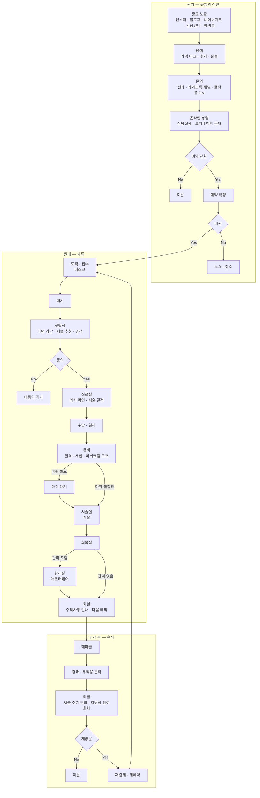
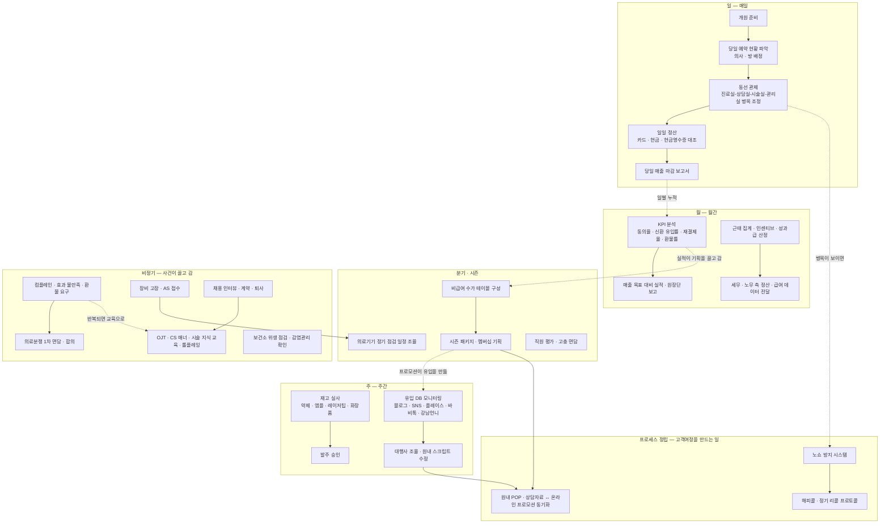

## 2. 시장환경 분석

### 2.1 고객여정

| 고객여정단계 | 시기 | 공간 | 비고 |
|---|---|---|---|
| 광고 노출 | 상시 | 원외 — 온라인 | 인스타 · 블로그 · 네이버지도 · 강남언니 · 바비톡 |
| 탐색 | 상시 | 원외 — 온라인 | 가격 비교 · 후기 · 별점 |
| 문의 | 탐색 직후 | 원외 — 전화 · 카카오톡 채널 · 플랫폼 DM | 인바운드 |
| 온라인 상담 | 문의 직후 ~ 수일 | 원외 | 상담실장 · 코디네이터 응대 |
| 예약 확정 | 상담 종료 시 | 원외 | 예약금 결제 |
| 노쇼 · 취소 | 예약일 | — | **이탈 분기** |
| 도착 · 접수 | 내원 T+0 | 데스크 | |
| 대기 | 내원 중 | 대기실 | 대기시간 미상 |
| 대면 상담 | 내원 중 | 상담실 | 시술 추천 · 견적. **이탈 분기**(동의율) |
| 진료 | 내원 중 | 진료실 | 의사 확인 · 시술 결정. ⚠ 상담과의 선후 미확인 |
| 수납 · 결제 | 동의 직후 | ⚠ 미확인 | 카드 · 현금 · 간편결제 |
| 준비 | 내원 중 | ⚠ 준비실 — 근거 없음 | 탈의 · 세안 · 마취크림 도포. ⚠ 문서 근거 없음 |
| 마취 대기 | 내원 중 | ⚠ 미확인 | 마취 시술에 한함. ⚠ 문서 근거 없음 |
| 시술 | 내원 중 | 시술실 | 소요시간 시술별 상이 |
| 회복 | 시술 직후 | ⚠ 회복실 — 방 이름 미확인 | |
| 애프터케어 | 시술 후 | 관리실 | 시술에 따라 유무 |
| 퇴실 | 내원 종료 | 데스크 | 주의사항 안내 · 다음 예약 |
| 해피콜 | 귀가 후 수일 | 원외 — 전화 · 카카오톡 | |
| 경과 · 부작용 문의 | 귀가 후 수일 ~ 수주 | 원외 | 환자 발신 |
| 리콜 | 시술 주기 도래 | 원외 | 보톡스 3~4개월 · 회원권 잔여회차 |
| 재방문 · 이탈 | 리콜 이후 | — | **이탈 분기**(재결제율) |

⚠ = 두 레퍼런스 문서에 근거가 없고 내가 채운 칸. 실제 클리닉 확인 필요

### 2.2 직원여정

고객 여정이 **환자 한 명의 선형 시간축**이라면, 직원 여정은 **주기로 도는 순환**이다.
환자와 닿지 않는 자리에서 일·주·월·분기 단위로 반복된다.

| 직원여정단계 | 시기 | 공간 | 담당 | 비고 |
|---|---|---|---|---|
| 개원 준비 | 매일 개원 전 | 원내 전역 | 코디네이터 · 간호조무사 | ⚠ 문서 근거 없음 |
| 당일 예약 현황 파악 · 배정 | 매일 개원 전 | 데스크 | 총괄실장 | 의사 · 방 배정 |
| 동선 관제 · 병목 조정 | 진료 중 상시 | 원내 전역 | 총괄실장 | 진료실-상담실-시술실-관리실 사이 |
| 일일 정산 | 매일 마감 | 데스크 | 총괄실장 · 코디네이터 | 카드 · 현금 · 현금영수증 일치 확인 |
| 당일 매출 마감 보고서 | 매일 마감 | ⚠ 미확인 | 총괄실장 | 원장단 보고 |
| 재고 실사 | 주기 미확인 ⚠ | 관리실 · 시술실 · 창고 | 총괄실장 · 관리실 | 약제 · 앰플 · 레이저팁 · 화장품 |
| 발주 승인 | 실사 직후 | ⚠ 미확인 | 총괄실장 | |
| 유입 DB 모니터링 | 주기 미확인 ⚠ | 데스크 · 원외 | 총괄실장 | 채널별 문의 건수 |
| 대행사 조율 · 스크립트 수정 | 비정기 | 원외 · 원내 | 총괄실장 | 전환율 최적화 |
| KPI 분석 | 월간 | ⚠ 미확인 | 총괄실장 | 동의율 · 신환 · 재결제율 · 환불률 |
| 매출 목표 수립 · 실적 보고 | 일 · 주 · 월간 | ⚠ 미확인 | 총괄실장 → 원장단 | |
| 근태 집계 · 인센티브 산정 | 월간 | ⚠ 미확인 | 총괄실장 | |
| 세무 · 노무 데이터 전달 | 월간 | 원외 | 총괄실장 → 세무사 · 노무사 | |
| 비급여 수가 테이블 구성 | 시즌 | ⚠ 미확인 | 총괄실장 → 원장단 | |
| 시즌 패키지 · 멤버십 기획 | 시즌 | ⚠ 미확인 | 총괄실장 | |
| 의료기기 정기 점검 | 분기 ⚠ | 시술실 | 총괄실장 ↔ 장비업체 | |
| 직원 평가 · 고충 면담 | 주기 미확인 ⚠ | ⚠ 미확인 | 총괄실장 | |
| 컴플레인 · 환불 1차 면담 | 사건 발생 시 | 상담실 ⚠ | 총괄실장 | 부작용 호소 · 효과 불만족 |
| 의료분쟁 대응 | 사건 발생 시 | ⚠ 미확인 | 총괄실장 · 원장단 | 합의 유도 |
| 장비 고장 · AS 접수 | 사건 발생 시 | 시술실 | 총괄실장 ↔ 장비업체 | |
| 채용 인터뷰 · 계약 · 퇴사 | 결원 발생 시 | ⚠ 미확인 | 총괄실장 | 코디 · 피부관리사 · 간호조무사 · 상담실장 |
| OJT · 롤플레잉 | 입사 시 · 비정기 | ⚠ 미확인 | 총괄실장 | CS 매너 · 비급여 시술 지식 · 스크립트 |
| 보건소 위생 점검 대응 | 비정기 | 원내 전역 | 총괄실장 | 감염관리 프로토콜 준수 확인 |
| 노쇼 방지 시스템 정립 | 비정기 | — | 총괄실장 | 고객여정을 만드는 일 |
| 해피콜 · 리콜 프로토콜 정립 | 비정기 | — | 총괄실장 | 고객여정을 만드는 일 |
| 원내 POP · 상담자료 동기화 | 프로모션 시 | 원내 전역 | 총괄실장 | 온라인 프로모션과 일치화 |

⚠ = 근거 없이 내가 채운 칸. 특히 **주기(일·주·월·분기) 배치는 대부분 내 추정**이다 —
`상담실장.md` 가 명시한 주기는 「매출 목표: 일·주·월간」 하나뿐이다

### 2.3 사용하는 툴

| 영역 | 툴 | 무엇을 하나 | 닿는 여정 | 근거 |
|---|---|---|---|---|
| 광고 · 노출 | 인스타그램 · 블로그 · 네이버 플레이스 | 콘텐츠 발행, 노출 | 2.1 광고 노출 | `상담실장.md` 5-1 · `병원 AX.md` |
| 플랫폼 | 강남언니 · 바비톡 | 시술 노출, 가격 비교, 후기 · 별점 | 2.1 탐색 | `상담실장.md` 5-1 |
| 후기 | 네이버 · 구글 리뷰 | 후기 축적, 평판 | 2.1 탐색 | `병원 AX.md` |
| 홈페이지 | 자사 홈페이지 | 상세페이지 · 이벤트 페이지 · 팝업 배너 | 2.1 탐색 | `병원 AX.md` |
| 문의 접수 | 전화 · 카카오톡 채널 | 인바운드 문의 응대 | 2.1 문의 · 온라인 상담 | `상담실장.md` 5-2 |
| 메시지 발송 | 카카오톡 | 프로모션 발송, 방문 안내 | 2.1 광고 · 퇴실 후 | `병원 AX.md` |
| 예약 | ⚠ 제품 미확인 | 예약 접수 · 슬롯 관리 · 예약금 | 2.1 예약 확정 | 「실시간 예약 가능 슬롯」만 언급 |
| 전자차트 | ⚠ 제품 미확인 | 진료기록 · 시술 이력 | 2.1 진료 · 시술 | `병원 AX.md` 에 「EMR」 단어만 등장 |
| 고객관리 | ⚠ 제품 미확인 | 고객 정보 · 회원권 잔여회차 · 리콜 대상 | 2.1 리콜 · 2.2 CRM 프로세스 | 「CRM」 단어만 등장 |
| 결제 | 카드 단말기 · 현금 · 현금영수증 | 수납 | 2.1 수납 · 2.2 일일 정산 | `상담실장.md` 6-1 |
| 정산 · 마감 | ⚠ 미확인 (엑셀 추정) | 카드 · 현금 대조, 마감 보고서 작성 | 2.2 일일 정산 · 마감 보고서 | `상담실장.md` 6-1 |
| 재고 | ⚠ 미확인 (실사 + 수기 추정) | 약제 · 앰플 · 레이저팁 · 화장품 수량 파악, 발주 | 2.2 재고 실사 · 발주 승인 | `상담실장.md` 4-2 「재고 실사」 |
| 급여 · 근태 | 근로계약서 · 급여대장 | 근무시간 기록, 수당 산정, 명세서 | 2.2 근태 집계 · 인센티브 | `병원 AX.md` · `상담실장.md` 3-3 |
| 회계 · 세무 | 외부 세무사 · 노무사 | 월별 정산 · 급여 데이터 전달, 신고 | 2.2 세무 · 노무 데이터 전달 | `상담실장.md` 6-2 |
| 회계 원천 | 은행 내역 · 카드 내역 · 세금계산서 | 매출 · 비용 원천 자료 | 2.2 월간 · 시즌 | `병원 AX.md` |
| 마케팅 성과 | ⚠ 미확인 | 채널별 유입 DB 모니터링 | 2.2 유입 DB 모니터링 | `상담실장.md` 5-1 |
| 상담 자료 | 원내 POP · 상담실 상담자료 | 시술 설명, 가격 안내 | 2.1 대면 상담 · 2.2 POP 동기화 | `상담실장.md` 5-3 |
| 동의서 | ⚠ 미확인 (종이 추정) | 시술 동의 취득 | 2.1 대면 상담 이후 | `병원 AX.md` 는 전자서명을 **TO-BE 로** 언급 |
| 의료기기 | 레이저 등 시술 장비 | 시술 수행 | 2.1 시술 | `상담실장.md` 4-3 |
| 장비 관리 | ⚠ 미확인 | 정기 점검 일정, AS 이력 | 2.2 의료기기 점검 · AS | `상담실장.md` 4-3 |
| 원내 소통 | ⚠ 문서에 언급 없음 | 직원 간 전달, 호출 | 2.2 동선 관제 | — |
| 교육 | ⚠ 미확인 (스크립트 · 롤플레잉) | OJT, CS 매너, 시술 지식 | 2.2 OJT | `상담실장.md` 3-2 |

⚠ = 문서에 **제품명이 없음.** 두 레퍼런스는 툴을 기능으로만 언급하고 실제로 뭘 쓰는지는
한 곳도 적지 않았다. 괄호 안 「추정」은 내가 통념으로 채운 것이므로 실제 클리닉 확인 전까지
근거가 아니다
