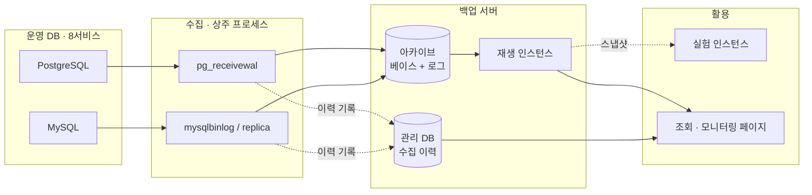
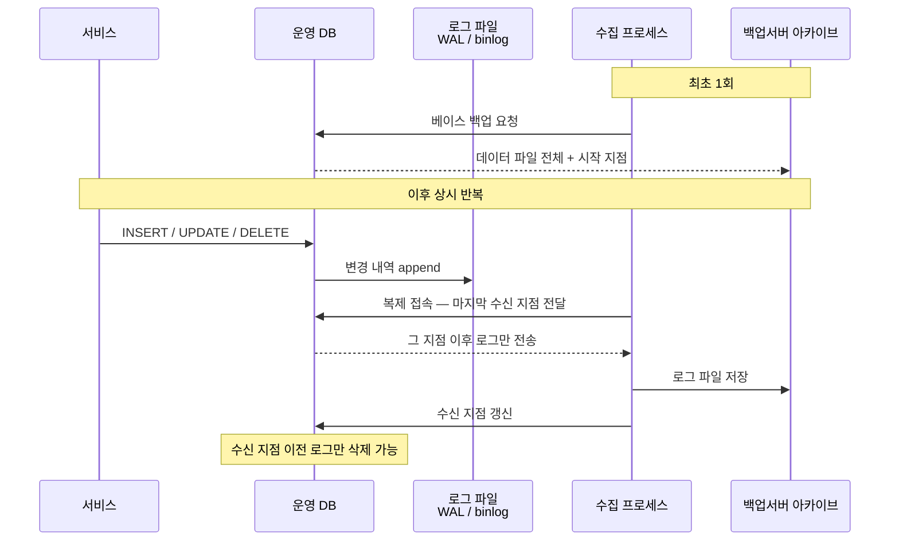
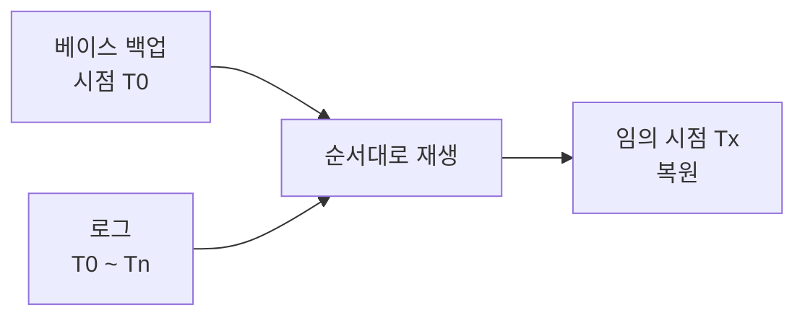
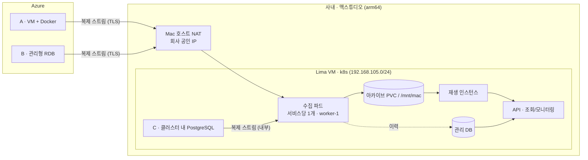

# 서비스 DB 백업 아키텍처

## 1. 목적

- 사내 8개 서비스의 운영 DB를 백업 서버에 **상시 수집**
- 전송량·비용 최소화 — 전체 덤프가 아닌 **변경분(바이너리 로그)만** 수집
- 수집한 데이터로 **조회·실험** 수행
- 수집 상태를 **모니터링 페이지**에서 확인
- **1명이 운영** 가능한 구조 유지

## 2. 현황

### 2.1 대상

- 사내 서비스 8개의 운영 DB
- 엔진 — MySQL · PostgreSQL 혼재 (버전 미확인)
- 서비스별 엔진·호스팅 배정, DB 크기 미확인

### 2.2 호스팅 형태

| 구분 | 위치 | 배포 형태 | 운영 주체 | DB 파일시스템 접근 |
|---|---|---|---|---|
| A | Azure | VM + Docker | 자체 | 가능 |
| B | Azure | 관리형 RDB (PaaS) | Azure | 불가 |
| C | 맥스튜디오 (온프렘) | k8s + Docker | 자체 | 가능 |

- 수집(복제 프로토콜)은 세 형태 모두 동일하게 적용 — 파일시스템 접근 불필요
- B는 파일시스템 접근이 없어 **베이스 백업 방식만 확인 필요** (§4-2)

## 3. 구현 방향

### 3.1 전체 플로우




### 3.2 수집 방식 비교

| 항목 | 덤프 | 바이너리 로그 (WAL / binlog) |
|---|---|---|
| 수집 동작 | 주기 실행 (cron) | **연결 유지 스트리밍** (상주) |
| 수집 지연 | 덤프 주기만큼 | 초 단위 |
| 일 전송량 | DB 전체 크기 | 변경분만 |
| 수집 소요 시간 | DB 크기에 비례, 매일 반복 | 로그 크기에 비례 |
| 소스 부하 | 매일 전체 테이블 읽기 | 이미 생성된 로그 파일 전송 |
| 복원 가능 시점 | 덤프를 뜬 시점만 | 수집 구간 내 임의 시점 |
| 구현 | cron + 명령 | 상주 프로세스 + 베이스 백업 1회 |
| 버전·아키텍처 | 무관 | 소스와 일치 필요 |
| 결과물 | 쓰기 가능 | 읽기 전용 (스냅샷으로 분기) |

- 상시 수집 조건에서는 **전송량이 결정적 차이** — 덤프는 매일 전체, 로그는 변경분
- 덤프가 유리한 항목(구현 단순·버전 무관·쓰기 가능)은 초기 1회와 스냅샷 분기로 대체 가능

**스트리밍 동작 구조**

- 수집 프로세스가 소스에 복제 연결을 열고 **연결을 유지** — 주기 폴링 아님
- 소스의 WAL sender가 로그가 기록되는 대로 열린 연결로 전송
- 주기적으로 오가는 것은 데이터가 아니라 **수신 지점 보고** (기본 10초 간격) → 이 신호로 slot 위치가 전진
- 세그먼트가 차기를 기다리지 않고 수신 즉시 기록 (`.partial`) → 지연 초 단위
- 수신 지점이 전진해야 소스가 이전 로그를 삭제 → **수집이 멈추면 소스 디스크가 증가**
  - `max_slot_wal_keep_size` 로 상한 설정 시 초과분은 slot 무효화 후 삭제 → 서비스 영향 차단

**소스 부하 비교**

| | 덤프 | 스트리밍 |
|---|---|---|
| 읽는 대상 | 전체 테이블 | 방금 기록된 WAL (대부분 페이지 캐시) |
| I/O 형태 | 대량 랜덤 읽기 | 순차 읽기, 디스크 접근 거의 없음 |
| 버퍼 캐시 | 운영 쿼리용 캐시가 덤프 데이터로 밀려남 | 영향 없음 |
| 트랜잭션 | 덤프 시간만큼 장기 유지 → vacuum 지연·테이블 팽창 | 없음 |
| CPU | 직렬화·압축 비용 | 미미 (무압축 전송) |
| 네트워크 | DB 크기만큼 집중 전송 | 변경량만큼 분산 전송 |

- 소스 부하는 **스트리밍이 덤프보다 낮음** — 추가로 생성하는 데이터 없이 기존 로그를 전송

#### 3.2.1 바이너리 로그 수집 원리

DB는 변경이 발생하면 데이터 파일을 바로 고치지 않고, **변경 내역을 로그에 먼저 순서대로 기록**한다. 수집은 이 로그를 복제 프로토콜로 받아오는 것이다.



- 전송 대상은 **이미 디스크에 기록된 로그 파일** — 테이블을 다시 읽지 않으므로 소스 부하가 낮음
- 수집 프로세스가 **마지막 수신 지점**을 소스에 알림 → 소스는 그 지점 이후 로그를 보존
- 재접속 시 중단 지점부터 이어받으므로 프로세스가 죽어도 구간 누락 없음

**복원**



- 베이스 백업 위에 로그를 순서대로 재생 → 로그가 있는 구간 내 임의 시점으로 복원
- 베이스와 로그는 **한 세트** — 로그만으로는 복원 불가

**엔진별 대응**

| | PostgreSQL | MySQL |
|---|---|---|
| 로그 | WAL 세그먼트 (16MB 고정) | binlog 파일 |
| 진행 지점 | LSN | 파일명 + 포지션 (또는 GTID) |
| 보존 보장 | replication slot | binlog 보존기간 설정 |
| 수집 도구 | `pg_receivewal` | replica 구성 또는 `mysqlbinlog` |

### 3.3 시스템 아키텍처



**통신 — 아웃바운드 단일 경로**

- 수집 연결은 **수집 파드에서 개시** — 소스는 인바운드만 허용, 사내로 들어오는 경로 불필요
- 클러스터 → 외부 경로

```
수집 파드 → Calico natOutgoing (노드 IP SNAT)
         → Lima eth0 (user-mode NIC)
         → Mac 호스트 NAT
         → 회사 공인 IP → 인터넷 → Azure
```

- **Azure 방화벽에 등록할 소스는 회사 공인 IP 1개** — VM 격리망(`192.168.105.0/24`)은 외부에 노출되지 않음
- Cloudflare Tunnel 은 **인바운드 전용**(인터넷 → CF 엣지 → `cloudflared` → ingress-nginx). 수집 경로와 무관하며 사이드카 불필요
- 클러스터 내 아웃바운드 제약 없음 — NetworkPolicy 0건, `HTTP_PROXY` 미설정
- 포트 — PostgreSQL 5432 · MySQL 3306
- 공중망 경유 구간(A·B)은 TLS 필수
- 클러스터 내 소스(C)는 ClusterIP 내부 통신
- ⚠ 회사망 아웃바운드 차단 정책은 **기록 없음** — 실제 접속으로 확인 필요

**받아오는 것**

| 시점 | 내용 | 크기 |
|---|---|---|
| 최초 1회 | 데이터 파일 전체 + 시작 지점 (LSN / binlog 포지션) | DB 전체 크기 |
| 상시 | WAL 세그먼트 · binlog 이벤트 | 변경량에 비례 |
| 모니터링 주기 | slot 지연 · 최종 수신 지점 | 수 KB |

**배치**

- 수집 파드 — Deployment, 서비스당 1개. 재시작·상태감시는 k8s 담당
- **`lima-worker-1` 고정** — `local-path` 의 nodePathMap 이 worker-1 하나뿐이라 PVC 를 쓰는 파드는 worker-1 에만 뜬다
  - `nodeSelector` 로 붙인다. **`nodeName` 금지** — 스케줄러를 우회해 PVC 가 영구 Pending
- 아카이브 — PVC(`local-path`, `/mnt/lima-pgdata`) 또는 `/mnt/mac`(Mac SSD virtiofs, worker-1 쓰기 마운트)
- 관리 DB · API · 프론트 — 클러스터 내 배포
- 재생 인스턴스 — **소스와 같은 PostgreSQL 메이저 버전** 필요 (다르면 기동 거부)
  - 클러스터는 arm64. x86_64 소스의 물리 베이스를 arm64 에서 재생하는 것은 PostgreSQL 공식 지원 범위 밖이나, 양쪽 모두 64bit 리틀엔디안·`MAXALIGN 8`·`BLCKSZ 8192` 이므로 `pg_control` 호환성 검사를 통과할 가능성이 있다 → **베이스 1회로 실측 필요**
  - 검증: `pg_controldata <베이스 경로>` 대조, 또는 복원 후 기동 시도
- 배포는 **ArgoCD GitOps 경유** — `kubectl apply` 직접 금지

#### 3.3.1 서비스 서버 / DB 에서 해야 할 것

**PostgreSQL**

- 파라미터 현재값 확인 — 기본값이면 변경 불필요

```
wal_level              = replica 이상   -- PG 10+ 기본값
max_wal_senders        ≥ 10             -- 기본값 10
max_replication_slots  ≥ 10             -- 기본값 10
max_slot_wal_keep_size = 설정           -- 수집 중단 시 소스 디스크 보호
```

- 수집 계정 생성 및 권한 부여

```sql
ALTER ROLE backup_user WITH REPLICATION;
```

- 접속 허용
  - A·C (자체 운영) — `pg_hba.conf` 에 replication 연결 허용
  - B (관리형) — Azure 방화벽 규칙에 사내 공인 IP 추가
- 파라미터를 변경하는 경우 **재시작 필요** → 서비스별 점검 일정 협의

**MySQL**

- 파라미터 현재값 확인

```
log_bin                     = ON       -- MySQL 8 기본값
binlog_format               = ROW      -- 기본값
binlog_expire_logs_seconds  = 설정     -- 수집 중단 대비 보존 기간 확보
server_id                   = 서비스별 고유값
```

- 수집 계정 생성 및 권한 부여

```sql
GRANT REPLICATION SLAVE, REPLICATION CLIENT ON *.* TO 'backup_user'@'%';
```

- 방화벽 3306 허용 (사내 공인 IP)

**공통**

- 최초 베이스 백업 1회 수행 허용 — `pg_basebackup` / XtraBackup
- TLS 접속 설정 (A·B — 공중망 경유)

#### 3.3.2 백업 서버에서 해야 할 것

**만들 것 / 안 만들 것**

| 구성요소 | 구현 | 배포 형태 |
|---|---|---|
| 로그 수집 | `pg_receivewal` · `mysqlbinlog` — **직접 만들지 않음** | Deployment · 서비스당 1개 |
| 상태 감시 · 알림 | **Python 데몬 1개** | Deployment · 전체 1개 |
| 베이스 백업 | `pg_basebackup` · XtraBackup | Job · 수동 실행 |
| 보존 정리 | Python 스크립트 | CronJob · 1일 1회 |

- 수집 프로세스 자체에는 코드를 넣지 않음 — 표준 바이너리를 그대로 실행
- 프로세스 생존·재시작은 k8s가 담당, 진행 상태는 **외부에서 관측 가능** (소스의 slot 위치 · 아카이브 파일 시각)
- 따라서 감시는 수집 파드 바깥의 독립 데몬 하나로 처리

**Python 상태 감시 데몬**

- 주기 — 1분
- 대상 — 서비스 8개 전체

| 수집 항목 | 취득 방법 |
|---|---|
| slot 지연 | PG: `SELECT slot_name, pg_wal_lsn_diff(pg_current_wal_lsn(), restart_lsn) FROM pg_replication_slots;`<br>MySQL: `SHOW BINARY LOGS` 와 replica 포지션 비교 |
| 최종 수신 시각 | 아카이브 디렉토리 최신 파일 mtime |
| 수집 파드 상태 | k8s API |

- 수집 결과를 관리 DB에 기록
- 임계치 초과 시 알림 발송 (슬랙 웹훅)
  - slot 지연 > 임계 용량
  - 최종 수신 시각 경과 > 임계 시간
  - 파드 비정상 종료

**관리 DB 스키마**

```sql
-- 주기 상태 스냅샷
collect_status (
  id, service, engine, checked_at,
  slot_lag_bytes,      -- 소스에 밀려 있는 양
  last_file_at,        -- 최종 로그 수신 시각
  pod_status           -- running / crashloop / absent
)

-- 이벤트 이력
collect_event (
  id, service, occurred_at,
  kind,                -- start / stop / error / alert
  detail
)

-- 베이스 백업 이력
base_backup (
  id, service, engine,
  started_at, finished_at,
  status, bytes, start_position,   -- LSN / binlog 파일·포지션
  artifact_path, error_message
)
```

**재기동 시 이어받기**

- PG — `pg_receivewal` 이 아카이브 디렉토리의 `.partial` 파일을 읽어 중단 지점부터 자동 재개
- MySQL — 마지막 수신 binlog 파일·포지션을 확인하여 해당 지점부터 재접속

**저장 · 활용**

- 아카이브 볼륨(PVC) — 베이스 + 로그 보존분 + 실험 스냅샷 합산 용량
- 재생 인스턴스 — 소스와 CPU 아키텍처 일치
- 실험 인스턴스 — 재생 인스턴스를 스냅샷하여 별도 기동 (CoW 파일시스템)

### 3.4 조회 · 모니터링 애플리케이션

**구성**

| 구성요소 | 내용 | 배포 |
|---|---|---|
| API 서버 | Python (FastAPI) — 관리 DB 조회 · 대상 인스턴스 쿼리 실행 | Deployment 1개 |
| 프론트 | 모니터링 대시보드 · 데이터 조회 화면 | Deployment 1개 (또는 API에서 정적 서빙) |

- 감시 데몬이 **쓰고**, API 서버가 **읽는다** — 같은 관리 DB를 공유
- 감시 데몬과 API 서버는 분리 — 조회 부하가 감시에 영향을 주지 않도록

**API 서버가 접근하는 대상**

| 대상 | 용도 | 접근 방식 |
|---|---|---|
| 관리 DB | 수집 상태 · 이벤트 · 베이스 백업 이력 | 자유 조회 (데이터 작음) |
| 재생 인스턴스 | 실제 데이터 조회 | 읽기 전용 롤 · 쿼리 제한 |
| 실험 인스턴스 | 실험 · 검증 | 쓰기 가능 |

**화면**

- 모니터링
  - 서비스별 수집 상태 — slot 지연 · 최종 수신 시각 · 파드 상태
  - 이벤트 이력 — 시작 · 중단 · 오류 · 알림
  - 베이스 백업 이력 — 시점 · 크기 · 시작 위치
- 조회
  - 대상 인스턴스 선택 → SQL 실행 → 결과 표시

**쿼리 실행 제약**

- 읽기 전용 DB 롤로 접속 (재생 인스턴스)
- 쿼리 타임아웃 설정
- 결과 행 수 상한
- 실행 이력 기록 — 사용자 · 시각 · 쿼리문
