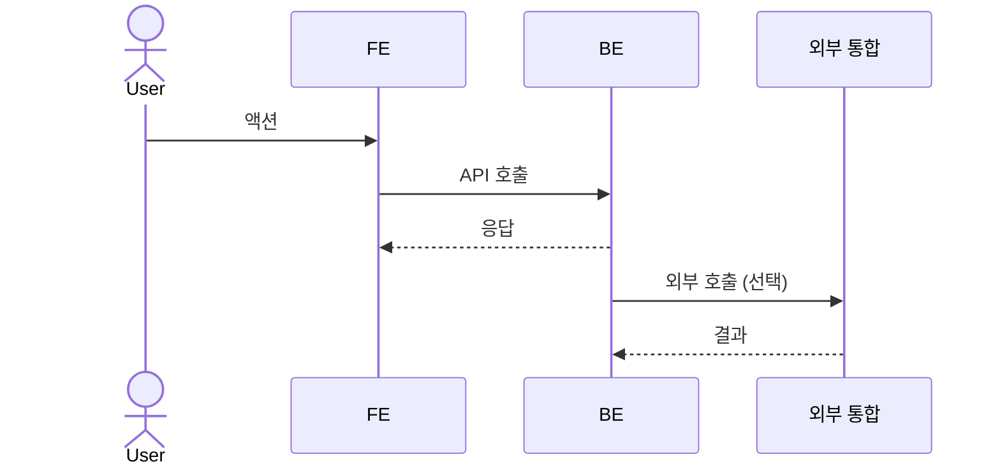
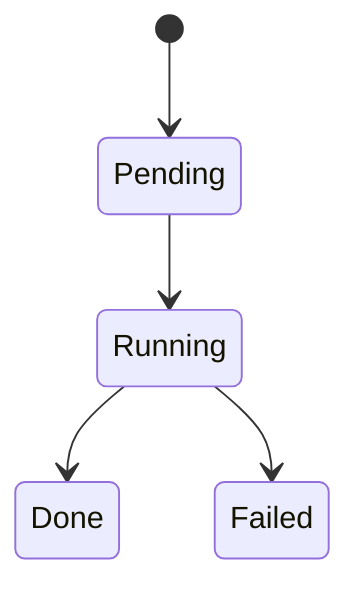

# Title

<1-2줄 요약: 이 기능이 사용자/시스템에 무엇을 보장하는지 적는다.>

> decision을 기능 계약으로 구체화하는 **외부 계약** 문서다. client / QA / 외부 통합이 이 문서만 읽고 따를 수 있어야 한다.
> table schema 전문, ORM field, repository/service 구조, 라우트·컴포넌트 파일 경로 같은 내부 구현은 본문에 두지 않는다.
> 실제 구현 순서와 작업 분리, 완료 조건 체크리스트는 `30-work/`에 둔다.

## Context

이 spec이 나온 배경과 연결된 decision.

- 관련 decision/baseline: (frontmatter `links`에도 연결)
- 비즈니스 요구: <왜 필요한가 — 사용자/운영/비즈니스 관점에서 이 spec이 보장하는 것>
- 범위(In/Out):

## UX Contract

화면, 상태, 문구, CTA, 에러/빈 상태 등 사용자에게 보이는 계약.
화면을 구성하는 컴포넌트/영역을 먼저 나열한 뒤, 각각을 `### U-N` 으로 박고 상태·문구·CTA·기대결과를 명시한다.
UI가 없는 spec(webhook/백그라운드 처리 등)이면 `해당 없음`으로 둔다.

### Placement

<모달 / 사이드바 / 페이지 등 화면 위치. UI 없는 spec은 `해당 없음`.>

```text
+──────────────────────────────────────────────────+
│ <상단 헤더>                                       │
+──────────────┬───────────────────────────────────+
│ <사이드바>   │ <탭 / 브레드크럼>                  │
│              │ <spec 화면 본문>                   │
+──────────────┴───────────────────────────────────+
```

### U-1. <컴포넌트/영역 이름>

- **상태**: 각 상태(정상/로딩/빈/에러/권한없음)에서 무엇이 보이는가
- **문구**: 노출 텍스트(헤더·라벨·플레이스홀더·안내·에러) — 화면에서 확인 가능한 비즈니스 용어로
- **CTA**: 액션 이름 · 컴포넌트 · 위치 · 활성/비활성 조건
- **기대 결과**: 액션 후 무엇이 일어나는가(페이지 이동/모달/토스트/데이터 갱신)

### U-2. <컴포넌트/영역 이름>

- **상태**:
- **문구**:
- **CTA**:
- **기대 결과**:

## User Scenario

이 spec이 보장하는 흐름을 actor별 시나리오로 나눠 박는다. 각 시나리오는 `### S-N. <actor> — <제목>` + 번호 매긴 단계로 서술하고, 단계 안에 조건·예외·경계·다른 spec 참조를 함께 적는다(QA가 단계 1:1로 TC 추출).
정상 흐름뿐 아니라 비정상·경계·권한·빈 상태·조건부 노출도 빠짐없이 나열한다. 순수 내부 처리만 있으면 `해당 없음`.

### S-1. <actor> — <시나리오 제목>

1. <단계>
2. <단계> (조건/예외/참조 inline)
3. <단계>

### S-2. <actor> — <시나리오 제목>

1. <단계>
2. <단계>

## FE Contract

프론트엔드가 지켜야 하는 외부 계약 — 상태, 컴포넌트 단위 입력/출력, validation 책임.
(라우트·페이지·컴포넌트 파일 경로 같은 구현 시작점은 `30-work/`에 둔다.)

## BE Contract

백엔드가 제공해야 하는 API, service behavior, 권한, 상태 전이.

### API 계약

| Method | Path | 요약 | 권한 |
|---|---|---|---|
| POST | `/<prefix>/...` |  | admin / staff |

### Request / Response 상세

<엔드포인트별 정상 응답 schema · status code. 에러는 여기 두지 않고 아래 Case Matrix가 단일 SoT. 긴 JSON schema는 `00-baseline/<BL-ID>/`로 분리하고 link.>

## Validation

입력 검증 규칙 — 어떤 입력이 valid한가만 적는다. FE(즉시 피드백)/BE(최종 신뢰 경계)가 같은 규칙을 각자 구현한다.
위반 시 에러코드·표시·위치는 아래 Case Matrix에 둔다.

| 필드 | 규칙 |
|---|---|
|  |  |

## Case Matrix

모든 에러/경계 케이스의 단일 SoT(validation 위반 · 권한 · 충돌 · 빈상태 · 로딩 등). API 상세는 정상 응답만, 에러는 전부 여기.

| 에러 코드 | 백엔드 출력 | 프론트 출력 | 표시 위치 |
|---|---|---|---|
|  |  |  |  |

## Flow

end-to-end 흐름을 sequence diagram으로 적는다.



## State Machine

외부에 드러나는 상태 전이가 있으면 Mermaid state diagram으로 적는다. 상태 전이가 없으면 `해당 없음`으로 둔다.
내부 구현 invariant(FOR UPDATE / partial unique 등)는 `30-work/` 또는 코드/migration에 둔다.



## Data Contract

외부에 드러나는 resource, field, enum, lifecycle.

## Work Handoff

이 spec에서 work의 Acceptance Criteria로 가져가야 할 계약 표면을 적는다.
체크리스트는 만들지 않는다. 구현 완료 조건, 테스트 완료 조건, PR 완료 조건은 `30-work/`에 둔다.

- 

## Open Questions

- 
