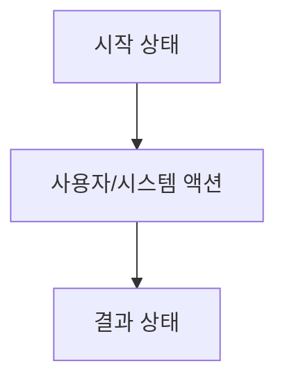
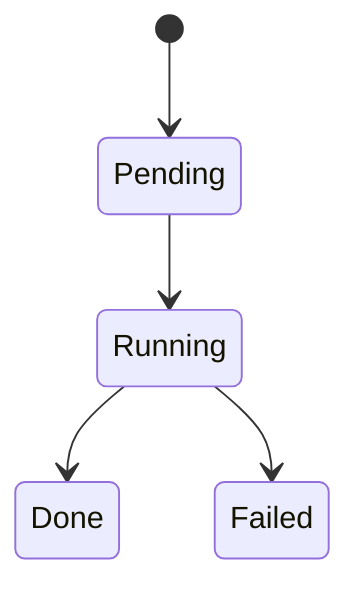

# Title

<1-2줄 요약: 이 기능이 사용자/시스템에 무엇을 보장하는지 적는다.>

> decision을 기능 계약으로 구체화하는 문서다.
> 실제 구현 순서와 작업 분리는 `30-work/`에 둔다.

## Context

이 spec이 나온 배경과 연결된 decision.

## User Flow

사용자가 겪는 흐름 또는 시스템이 수행해야 하는 흐름을 Mermaid로 적는다.

## State Machine

상태 전이가 있는 기능이면 Mermaid state diagram으로 적는다. 상태 전이가 없으면 `해당 없음`으로 둔다.

## UX Contract

화면, 상태, 문구, CTA, 에러/빈 상태 등 사용자에게 보이는 계약.

## FE Contract

프론트엔드에서 지켜야 하는 상태, 컴포넌트, 입력/출력, validation.

## BE Contract

백엔드에서 제공해야 하는 API, service behavior, 권한, 상태 전이.

## Data Contract

외부에 드러나는 resource, field, enum, lifecycle.

## Work Handoff

이 spec에서 work의 Acceptance Criteria로 가져가야 할 계약 표면을 적는다.
체크리스트는 만들지 않는다. 구현 완료 조건, 테스트 완료 조건, PR 완료 조건은 `30-work/`에 둔다.

- 

## Open Questions

- 
