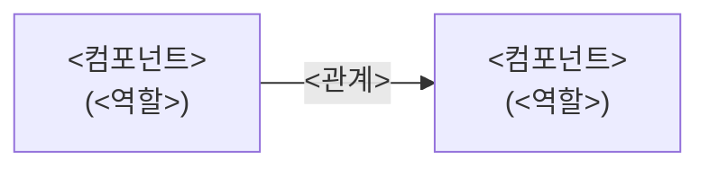

<!--
  showcase.md 템플릿 — 회사 제품 / 개인 프로젝트 상세.
  detail_path 가 이 파일을 가리키고, /career 모달 또는 /projects 상세로 렌더된다.

  ─────────────────────────────────────────────────────────────
  읽는 사람은 채용 담당자다. 위에서 아래로 30초 안에 훑는다.
  「무슨 서비스 → 무엇을 하나 → 어떻게 잘 지었나 → 어떻게 만들었나」 순서로 읽히게 한다.

  톤 규칙
  - frontmatter 없음. 메타(제목·요약·기술·상태)는 DB 가 갖는다. 본문만 쓴다.
  - 개발자 자랑이 아니라 「쓰는 사람 관점」으로. "~를 서빙한다"(만든 쪽) 말고
    "~를 할 수 있다"(쓰는 쪽). 단, 「핵심 설계」만 개발자용이라 기술 용어를 살린다.
  - AI 티 안 나게. 번역체(~을 통해·~에 대한·가지다), hype 어휘(혁신적·다채로운),
    결산 상투구(결론적으로·주목할 만하다) 금지. 담백하게 단정한다.
  - 명사형 섹션명(개요·주요기능·핵심 설계·아키텍처·기술스택) 유지.
  - 이미지는 원장 옆 assets/ 에 두고 상대참조 ``.
  ─────────────────────────────────────────────────────────────
-->

# 개요

<!-- 무엇을·누구를 위해를 첫 문장에 박는다. 흩어져 있던 문제 → 이 제품이 그걸 어떻게
     모았는지 → 목표. 2문단 정도. 개발 구조 설명은 뒤로 미룬다. -->

<제품명> 은 <한 줄로 무엇인가>. <어떤 문제가 어디에 흩어져 있었는지>, 그것을
<이 제품이 어떻게 한곳에 모았는지> 적는다. <개발자가 아니어도 / 고객이 / 누가>
<무엇을 할 수 있게 하는 것이 목표인지>.

<확장 흐름 한 문단 — 어디서 시작해 어디까지 넓혔는지. 만든 방식(예: 문서 우선).>

> 규모 한 줄 — 기능 명세 NN+ · 작업 단위 NN+ · 컴포넌트 N · 팀 N인
<!-- 채용자는 수치로 규모를 읽는다. 실제 숫자만. 없으면 이 줄을 지운다. -->

# 주요기능

<!-- 기능을 3~4 묶음으로 그룹핑한다. 평면 나열보다 스토리가 생긴다.
     각 묶음: 기능/목적/효과 표(한 줄씩) + 대표 스크린샷 1장 + 세부 기능 2~3개.
     세부는 「무엇을 넣고 무엇을 할 수 있나」로. 개발 용어 걷어낸다. -->

## <묶음 이름 1 — 예: 지식을 모은다>

| 구분 | 내용 |
|---|---|
| **기능** | <이 묶음이 무엇을 하는가 · 한 줄> |
| **목적** | <어떤 불편을 없애려고 · 한 줄> |
| **효과** | <그래서 무엇이 좋아지나 · 한 줄> |

- **<세부 기능>** — <무엇을 넣고 무엇을 할 수 있는지. 쓰는 사람 관점, 한두 문장>
- **<세부 기능>** — <〃>

## <묶음 이름 2 — 예: 일을 기록한다>

| 구분 | 내용 |
|---|---|
| **기능** | <…> |
| **목적** | <…> |
| **효과** | <…> |

- **<세부 기능>** — <…>
- **<세부 기능>** — <…>

## <묶음 이름 3 — 예: AI 가 일한다>

| 구분 | 내용 |
|---|---|
| **기능** | <…> |
| **목적** | <…> |
| **효과** | <…> |

- **<세부 기능>** — <…>
- **<세부 기능>** — <…>

# 핵심 설계

<!-- 이 섹션만 개발자(기술 면접관)가 본다. 기술 용어를 살려도 된다.
     「무엇을 했다」가 아니라 「어떤 문제 때문에 → 이렇게 판단했고 → 그래서 무엇을 얻었나」.
     자랑거리 3~4개만. 각 항목: 굵은 제목(판단) + 3줄 안팎. -->

**<판단 1 · 한 줄로 단정>** <왜 이 문제가 있었는지, 그래서 어떻게 결정했는지,
그 덕에 무엇이 좋아졌는지 3줄 안팎.>

**<판단 2>** <…>

**<판단 3>** <…>

**<판단 4>** <…>

# 아키텍처

<!-- 컴포넌트 구성과 데이터 흐름. 글로만 두지 말고 mermaid 다이어그램으로.
     핵심 설계 원칙(예: 서버가 무엇을 안 한다)이 화살표로 드러나게. -->

<한 문단 — 몇 컴포넌트로 나뉘고, 핵심 흐름/원칙이 무엇인지.>

- **<컴포넌트>** — <한 줄 역할>
- **<컴포넌트>** — <한 줄 역할>

# 기술스택

<!-- 채용자가 스캔한다. 「왜 골랐나」는 위 핵심 설계가 담당하니 여기선 뺀다.
     영역 | 스택 두 컬럼만. 실제 쓴 것만. -->

| 영역 | 스택 |
|---|---|
| 백엔드 | <…> |
| 프론트 | <…> |
| 인프라·운영 | <…> |
| 기타 | <…> |
